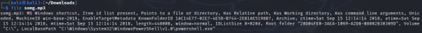
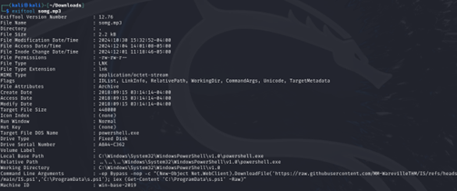
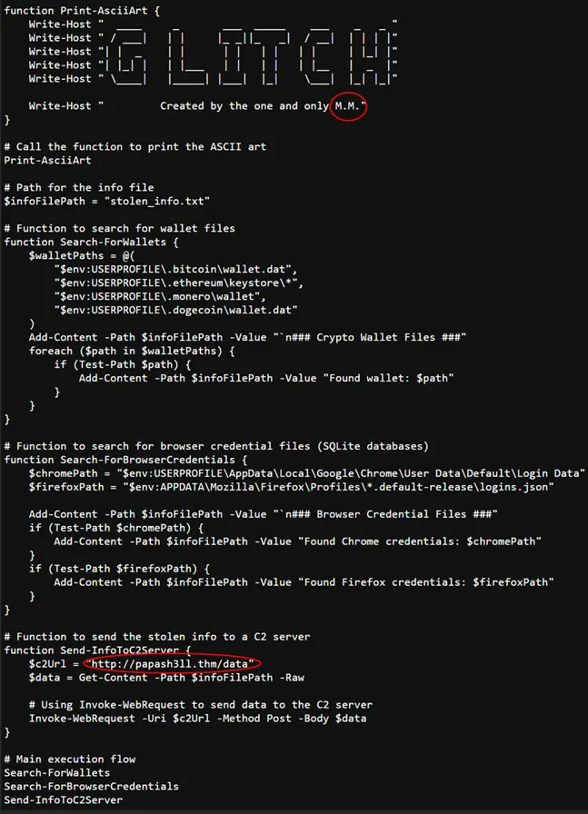
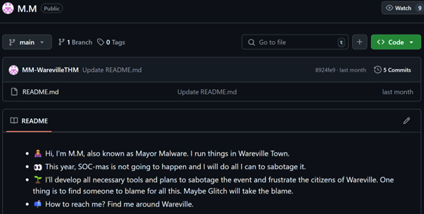
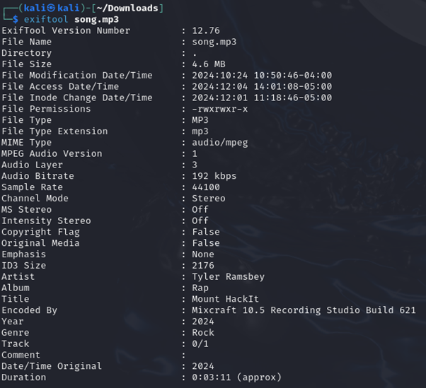

# Advent of Cyber 2024 - Day 1

## Challenge Overview
Day 1 of Advent of Cyber 2024 begins with analyzing a website that converts YouTube videos to MP3 or MP4 files. To access this site, we need to use a web browser to connect to the assigned Machine IP from TryHackMe. Once we are connected, we can use any YouTube link to test this site. I used the link provided by TryHackMe.

## Observations After Conversion
Once we download the files after converting them, we notice there are two files: `song.mp3` and `somg.mp3`. We can use `file` and `exiftool` to analyze these files further.

### File Analysis
- Running `file somg.mp3`, we immediately see that `somg.mp3` is not an MP3 file. 

- Running `exiftool somg.mp3`, we see that it is actually a `.lnk` file that downloads and executes a malicious PowerShell script. If we visit the link it is downloading the script from ([IS.ps1](https://raw.githubusercontent.com/MMWarevilleTHM/IS/refs/heads/main/IS.ps1)), we can see that it is a PowerShell script meant to collect cryptocurrency wallets and browser credentials from victims’ PCs. The script also contains the URL to the C2 server where stolen data is sent. Additionally, the file is signed by "M.M."

## Investigating M.M.
We can search GitHub for “Created by the one and only M.M.” or use the GitHub link provided by THM. On GitHub, we find a repository called `CryptoWallet-Search` with one commit. Inside, we see an issue titled “PowerShell Version of this?” Investigating this issue further leads to a new GitHub profile. Within this profile, we find a file named `M.M` that reveals the true identity of M.M.: Mayor Malware.

## Additional Insights
Using `exiftool` on `song.mp3`, we discover that while it appears to be a valid MP3 file, the author metadata shows it was created not by Rick Astley, but by Tyler Ramsbey.

## Key Takeaways
Using tools like `file` and `exiftool` was critical for analyzing the files and uncovering hidden malicious activities. This challenge highlights the importance of carefully examining metadata and scripts to identify threats effectively.
