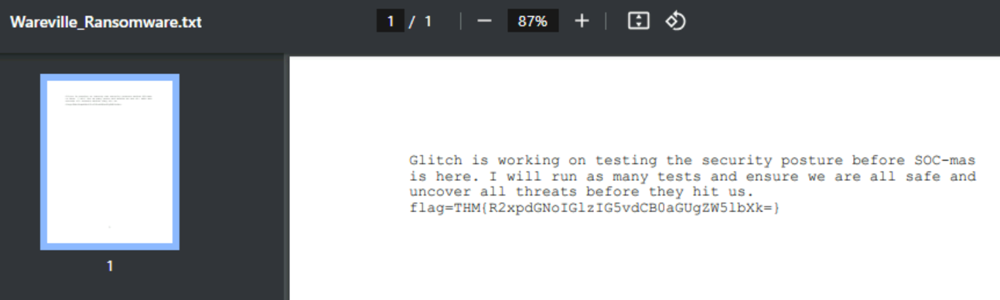

# Advent of Cyber 2024 - Day 4

## Challenge Overview
Day 4 focused on identifying detection gaps, understanding MITRE ATT&CK techniques, and using Atomic Red Team to emulate attacks. The challenge aimed to simulate a spearphishing attack and a ransomware attack, gather the necessary indicators of compromise, and create detection rules to identify these attacks in the future.

---

## Learning Objectives
- Understand how to identify malicious techniques using the MITRE ATT&CK framework.
- Learn how to use Atomic Red Team tests to conduct attack simulations.
- Understand how to create alerting and detection rules from the attack tests.

### Environment Details
The machine provided came with Atomic Red Team and Sysmon pre-installed, allowing us to emulate attacks using the MITRE ATT&CK framework's TTPs and detect artifacts using Windows Event Viewer.

---

## Attack Simulation

### Spearphishing Attachment (T1566.001)
To begin, we simulated a spearphishing attack using Atomic Red Team to test the MITRE ATT&CK technique `T1566.001 - Spearphishing with an Attachment`.

#### Executing the Atomic Test
We executed the test using PowerShell with the following command:

```Invoke-AtomicTest T1566.001 -TestNumbers 1```

This command simulated a spearphishing attack by downloading a macro-enabled phishing attachment to the `%temp%` directory.


---

### Detection Using Sysmon
After executing the Atomic test, we utilized Sysmon and Windows Event Viewer to identify Indicators of Compromise (IoCs).

1. **PowerShell Process Creation**: Sysmon recorded a process creation event when PowerShell downloaded the phishing attachment.

   

2. **File Creation**: The phishing attachment, `PhishingAttachment.xlsm`, was saved to the `%temp%` directory. We found a `.txt` file named `PhishingAttachment.txt` in the same location, containing the flag:

```THM{GlitchTestingForSpearphishing}```


---

## Ransomware Simulation

### ATT&CK Technique of Interest
To proceed with ransomware simulation, we identified our technique of interest as `T1059 - Command and Scripting Interpreter`. Specifically, we focused on the subtechnique `T1059.003 - Windows Command Shell`.


### Running the Atomic Test
We selected the Atomic Test named **"Simulate BlackByte Ransomware Print Bombing"** and executed it to emulate the attack. This test involved printing a file using WordPad to simulate the behavior of BlackByte ransomware.


To execute this test using PowerShell, we used the following command:
```Invoke-AtomicTest T1059.003 -TestNumbers 4```

The file used in the test was `Wareville_Ransomware.txt`, which contained a flag after successful simulation:

```flag=THM{R2xpdGNoIGlzIG5vdCB0aGUgZW5lbXk=}```



---

## Key Findings

- **Flag from Spearphishing Test**: Located in the `%temp%` directory under the name `PhishingAttachment.txt`.
- **ATT&CK Techniques Used**:
  - **T1566.001**: Spearphishing with an Attachment.
  - **T1059.003**: Windows Command Shell.
- **Atomic Test for Ransomware**: Executed the **"Simulate BlackByte Ransomware Print Bombing"** test.

---

## Recommendations

1. **Detection and Monitoring**:
   - Use **Sysmon** for comprehensive logging of process creation, network events, and file creation.
   - Leverage **SIEM** or **EDR** to ingest Sysmon logs and apply detection rules to alert on suspicious behavior, such as PowerShell downloading files or Word spawning command shells.

2. **Implement Sigma Rules**:
   - Write and implement Sigma rules to detect common spearphishing indicators like `Invoke-WebRequest` or suspicious file creations.

3. **Awareness and Training**:
   - Provide employees with training on identifying phishing emails, especially those containing macro-enabled attachments.

---

## Conclusion
Day 4 focused on using Atomic Red Team to simulate common attack vectors and identify detection gaps using Sysmon and MITRE ATT&CK techniques. By emulating spearphishing and ransomware scenarios, we were able to identify indicators of compromise and create effective detection rules to enhance the security posture of Wareville.

These exercises demonstrated the importance of proactive attack simulation and log analysis in improving blue team detection capabilities.


