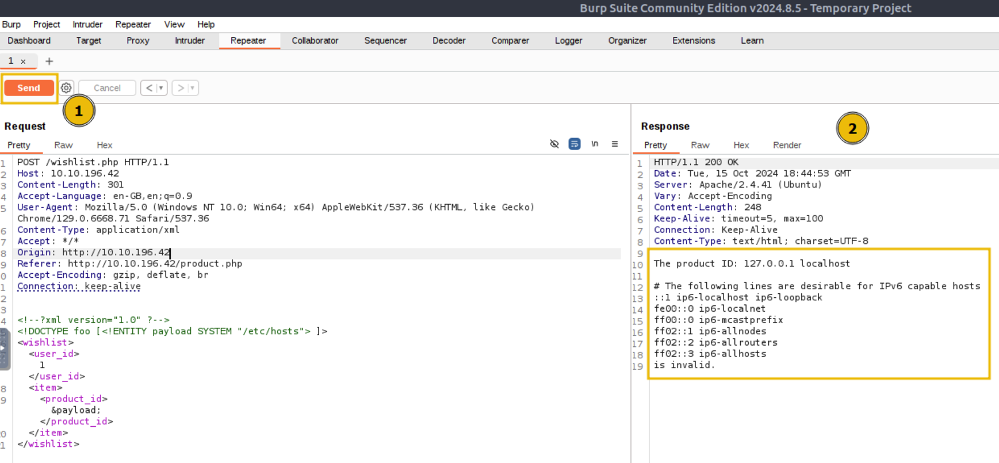
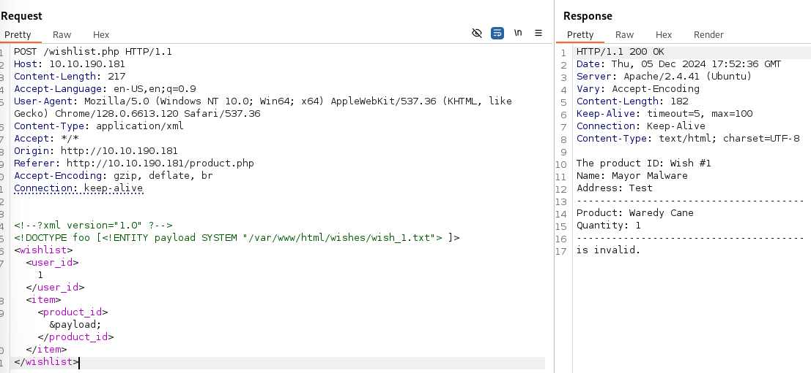
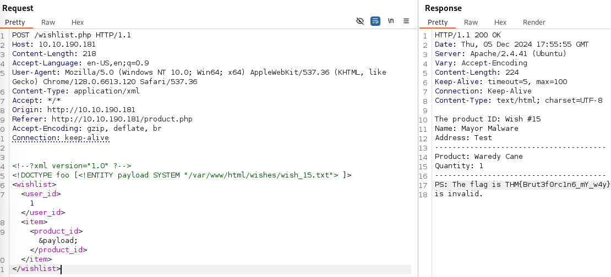
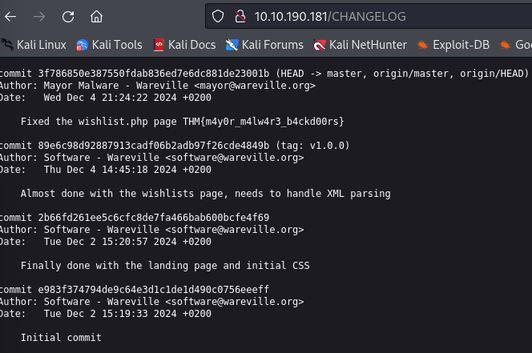

# Advent of Cyber 2024 - Day 5

## Challenge Overview
Day 5 of Advent of Cyber 2024 focuses on understanding and exploiting an XML External Entity (XXE) vulnerability in Wareville's WishVille application. The goal was to use the vulnerability to extract sensitive data from the server, including user-submitted wishes.

---

## Observations

### Analyzing the WishVille Application
The WishVille application allows users to add items to their wishlist, which then gets processed by `wishlist.php`. The endpoint accepts XML input, and we discovered that due to improper handling of external entities, the application was vulnerable to XXE attacks.

### Setting Up Burp Suite for Exploitation
To intercept and manipulate requests effectively, we first had to configure Burp Suite properly. Specifically, we needed to disable Burp Suite's sandbox setting to allow its embedded browser to interact seamlessly with the web application.

#### Disabling Burp Sandbox
- Opened Burp Suite settings and navigated to the **Tools** section.
- Enabled the option **"Allow Burp's browser to run without a sandbox"**.
- This step was crucial as it ensured that Burp's embedded browser could be used to properly interact with and intercept the web requests made to the WishVille application.


After configuring Burp Suite, we used the embedded browser to browse the WishVille application, ensuring that all requests would be intercepted for further analysis. We used Burp Suite to intercept the request to `wishlist.php` when adding items to the wishlist. The intercepted request showed that the application was using XML for data transmission.

![Browsing to WishVille Application] (images/WishlistButton)

![Making a Wish] (images/WishMade.png)
---

#### Crafting the Initial Payload
The initial payload was crafted to include an external entity referencing the `/etc/hosts` file on the server to verify if the application was vulnerable to XXE:
```xml
<!DOCTYPE foo [<!ENTITY payload SYSTEM "/etc/hosts"> ]>
<wishlist>
  <user_id>1</user_id>
  <item>
    <product_id>&payload;</product_id>
  </item>
</wishlist>
```
We sent the payload using Burp Suite's Repeater and successfully received the contents of the /etc/hosts file, confirming the vulnerability.



---
#### Extracting Sensitive Wishes
After confirming the XXE vulnerability, we moved on to exploit the application further by attempting to access sensitive wish files.

We modified the payload to read wish_1.txt stored in /var/www/html/wishes/:
```xml
<!DOCTYPE foo [<!ENTITY payload SYSTEM "/var/www/html/wishes/wish_1.txt"> ]>
<wishlist>
  <user_id>1</user_id>
  <item>
    <product_id>&payload;</product_id>
  </item>
</wishlist>
```



Sending this payload allowed us to access the content of wish_1.txt, confirming sensitive wish data could be extracted. We continued iterating through the wish files by incrementing the numbers (wish_2.txt, wish_3.txt, etc.) until we found a wish containing a flag:



---

### Investigating The CHANGELOG
To understand how the vulnerability was introduced, we accessed the CHANGELOG file at http://MACHINE_IP/CHANGELOG. The logs revealed that the vulnerable code was pushed by Mayor Malware, raising suspicion regarding his involvement.



##Key Findings
	- Confirmed XXE Vulnerability: Successfully exploited an XXE vulnerability by accessing sensitive server files, starting with the /etc/hosts file.
	- Accessed User Wishes: Extracted user-submitted wishes from the application’s directory, revealing sensitive information stored in wish_1.txt and other files.
	- Found a flag in wish_15.txt during the iteration through the wish files, demonstrating the extent of data exposure.
	- Reviewed the CHANGELOG to determine that Mayor Malware had pushed the vulnerable code, indicating a possible intentional introduction of the flaw.

## Recommendations:
1. **Disable External Entity Loading**:
	- Set libxml_disable_entity_loader(true) to prevent loading of external entities.

2. **Validate and Sanitize User Input**:
	- Implement robust validation of incoming XML data to ensure only expected data types are processed.

3. **Access Control**:
	- Restrict access to sensitive files and directories such as /var/www/html/wishes/ to authorized users only.

4. **Log Monitoring**:
	- Set alerts for unusual access patterns or multiple failed attempts to access restricted files.
	
## Conclusion: 
This challenge demonstrated how an XXE vulnerability can be exploited to access sensitive information, underscoring the importance of secure coding practices, proper input validation, and regular security testing. Disabling Burp's browser sandbox was crucial in allowing us to intercept and manipulate web requests efficiently, facilitating the discovery and exploitation of the vulnerability. Implementing the recommended security measures can significantly mitigate the risk of XXE attacks in web applications.