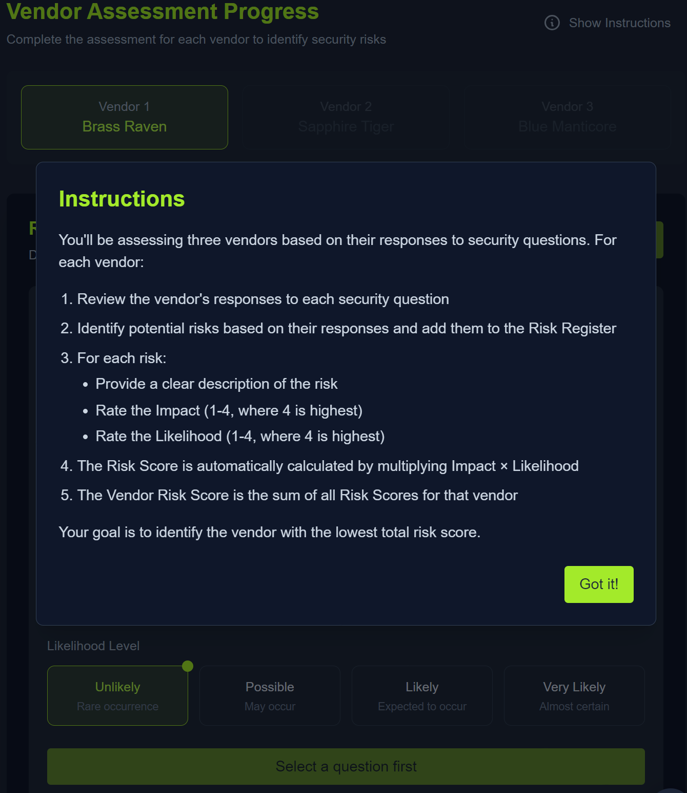
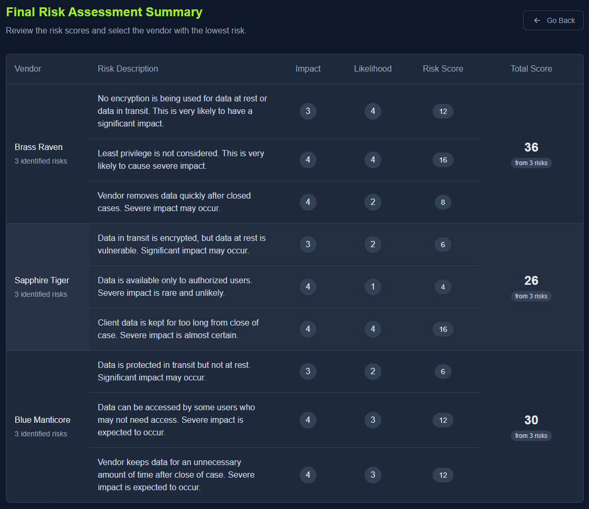
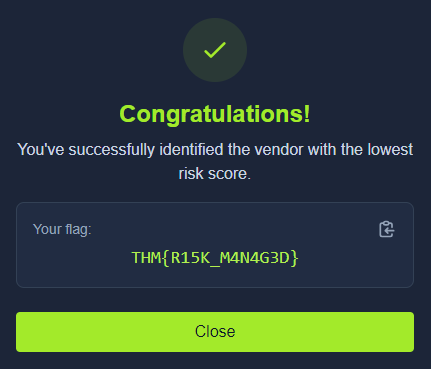

# Advent of Cyber 2024 - Day 9

## Challenge Overview

Understand the role of Governance, Risk, and Compliance (GRC) in cybersecurity by evaluating vendors' responses to security questions, identifying risks, and selecting the vendor with the lowest risk score.

---

## Vendor Assessment Steps

### Review Vendor Responses
- Vendors provided answers to security-related questions.
- Responses are analyzed to identify potential risks.

---

### Final Risk Assessment Summary
- Assign impact and likelihood scores to identified risks for each vendor.
- Calculate total risk scores to compare vendors.

---

### Choosing the Vendor
- The vendor with the lowest total risk score is selected as the safest option.
- By evaluating risks carefully, McSkidy and Glitch ensured the integrity of their investigation.

---

## Key Findings
1. **GRC Fundamentals**: 
   - Governance provides the framework for security policies.
   - Risk focuses on identifying and mitigating vulnerabilities.
   - Compliance ensures adherence to legal and regulatory standards.
2. **Risk Assessment Approach**:
   - Risks were assigned numerical scores based on impact and likelihood.
   - Vendors were evaluated on encryption, data access, and retention policies.
3. **Outcome**:
   - Sapphire Tiger was identified as the vendor with the lowest risk score (26).
   - They demonstrated strong data access control and minimized risk exposure.

---

## **Conclusion**
The exercise highlights the importance of systematic risk assessment in selecting secure third-party vendors. GRC principles guided McSkidy and Glitch to a data-driven decision, ensuring minimal risk to their sensitive investigation.

---

## **Flag**

**Flag**: `THM{R15K_M4N4G3D}`
