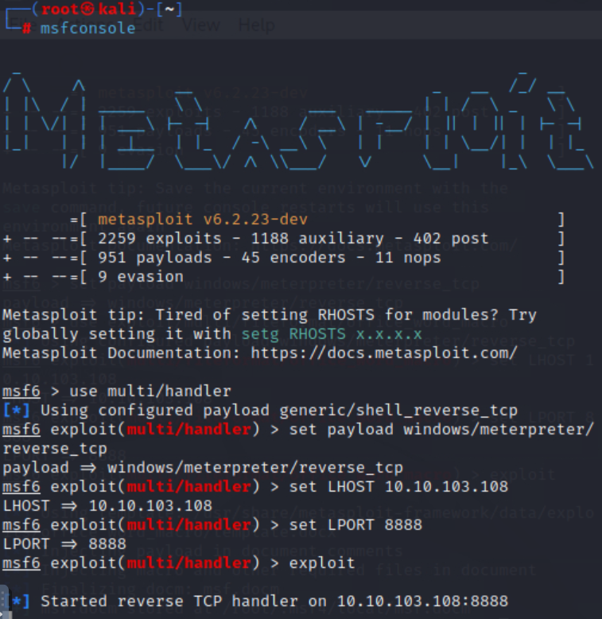
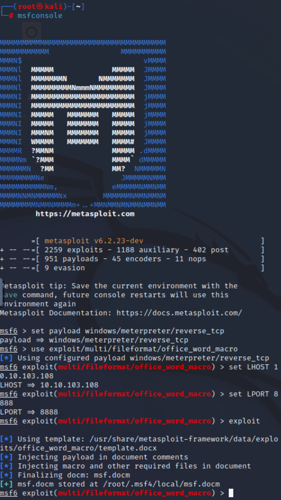
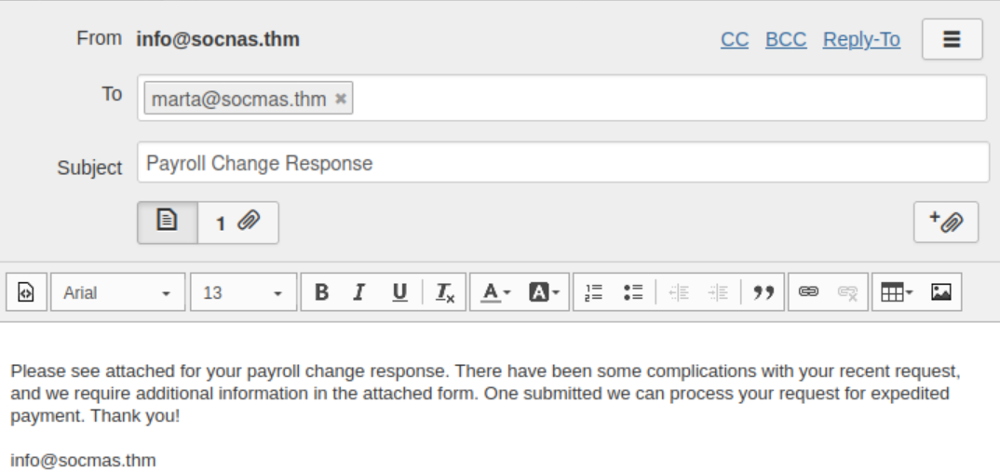
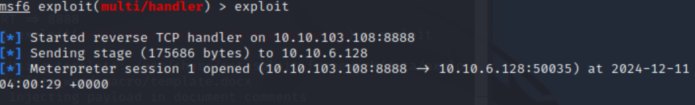
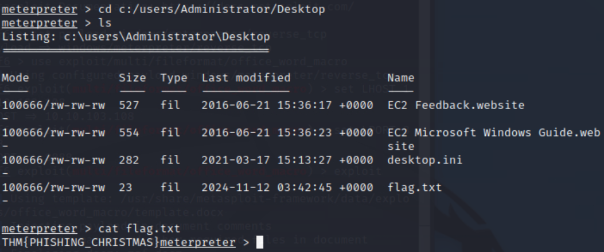

# Advent of Cyber 2024 - Day 10

## Challenge Overview
Explore how phishing attacks can exploit human vulnerabilities by embedding malicious macros in documents. This challenge demonstrates creating, delivering, and executing a phishing payload to gain unauthorized access.

---

## Steps

### Setting up the Listener
We began by setting up a reverse TCP handler using Metasploit to listen for incoming connections.

---

### Crafting the Malicious Document
Using Metasploit, we generated a macro-enabled document with an embedded reverse shell payload. The payload was configured to connect back to the AttackBox.

---

### Crafting the Phishing Email
A phishing email was composed to deliver the malicious document. The email leveraged typosquatting and urgent messaging to entice the target to open the file.

---

### Payload Execution and Shell Established
Once the target opened the malicious document, the macro executed the payload. This resulted in a reverse shell being established, granting access to the target system.

---

### Retrieving the Flag
With the reverse shell, we navigated to the Administrator's desktop and located the `flag.txt` file.

**Flag**: `THM{PHISHING_CHRISTMAS}`

---

## Key Findings
1. **Phishing Techniques**: This exercise highlighted how attackers craft convincing emails to lure victims into executing malicious payloads.
2. **Malicious Macro Exploitation**: Using macros embedded in MS Office documents, attackers can execute payloads to establish a reverse shell connection.
3. **Payload Execution**: Configured a reverse shell listener and gained access to the target system, showcasing the importance of user awareness against phishing attacks.
4. **Domain Typosquatting**: Demonstrated the use of typosquatting to deceive users with seemingly legitimate email domains.

---

## Conclusion
This task underlines the importance of user training, email vigilance, and robust cybersecurity measures to mitigate phishing risks.