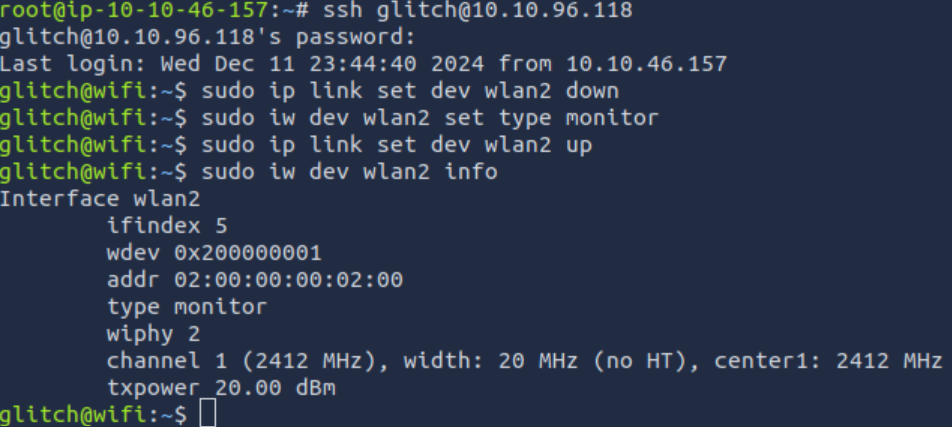
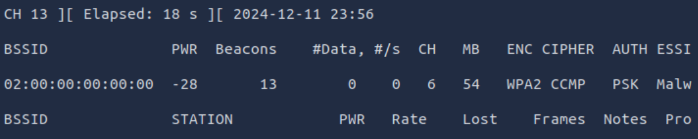
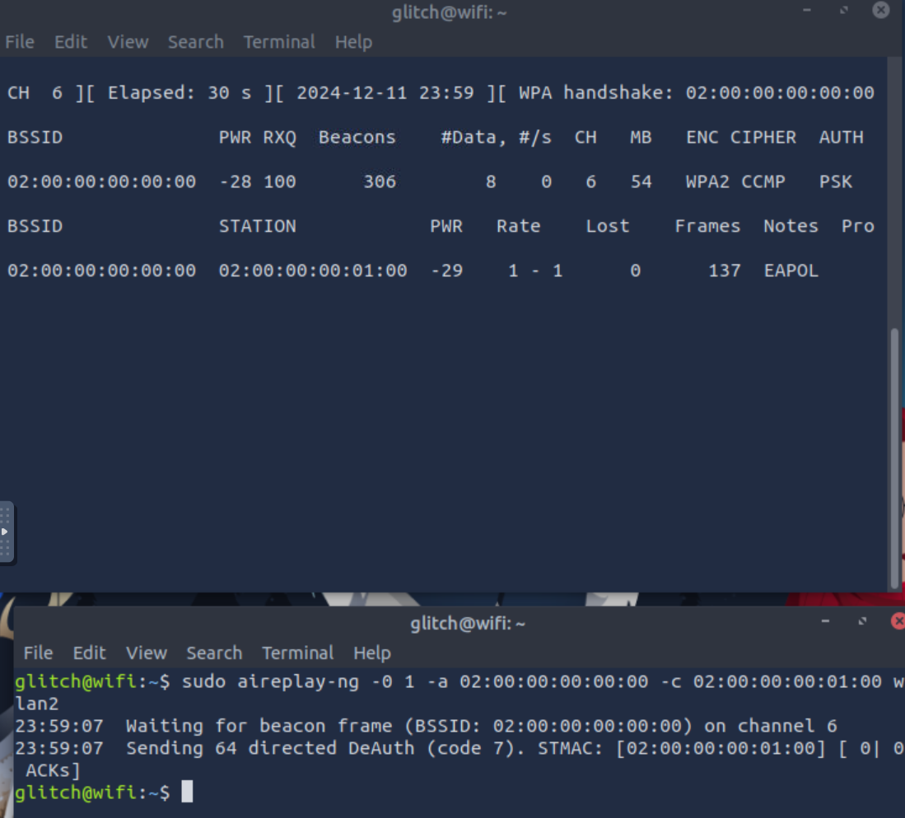
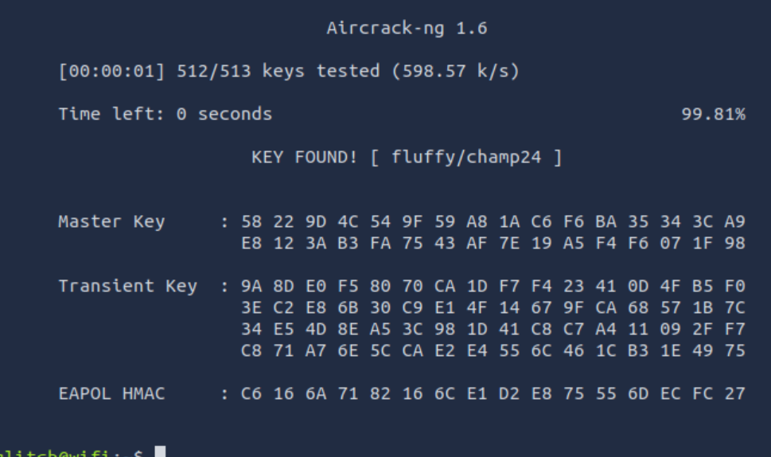
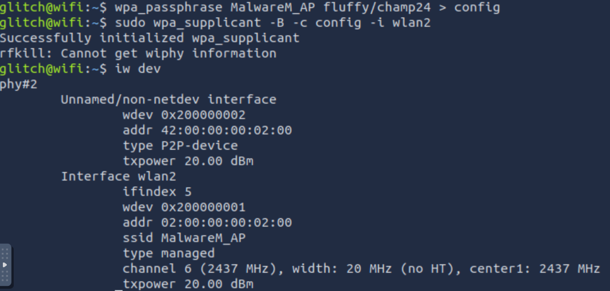

# Advent of Cyber 2024 - Day 11

## Challenge Overview

Learn about Wi-Fi security, different attack techniques, and demonstrate a WPA/WPA2 cracking attack to uncover vulnerabilities in wireless networks.

---

## Wi-Fi Security Basics

- Wi-Fi is a technology connecting devices wirelessly to the internet via access points.
- Secure communication relies on strong encryption protocols like WPA2 and robust passwords.
- Understanding vulnerabilities in Wi-Fi helps strengthen network defenses.

---

## WPA/WPA2 Cracking Demonstration

### Setting Up the Wireless Interface
- Identify available wireless devices and switch the interface to monitor mode.

---

### Scanning for Access Points
- Scan for nearby Wi-Fi networks to identify targets.
- Locate the target SSID and BSSID.

---

### Capturing the WPA Handshake
- Deauthenticate connected clients to force reconnection and capture the handshake.

---

### Cracking the WPA2 Password
- Use captured handshake data to brute-force the Pre-Shared Key (PSK) with a wordlist.

---

### Joining the Network
- After obtaining the PSK, join the Wi-Fi network to demonstrate access.

---

## Key Findings
1. **Wi-Fi Vulnerabilities**:
   - Weak passwords are a significant risk in WPA2 networks.
   - Attackers can exploit handshake captures for offline brute-force attacks.
2. **Mitigation Strategies**:
   - Use strong, complex passwords for WPA2 networks.
   - Disable WPS (Wi-Fi Protected Setup) to reduce brute-force risks.
   - Regularly monitor and audit network security.

---

## **Conclusion**
The exercise demonstrates the critical importance of securing wireless networks to prevent unauthorized access. By understanding WPA/WPA2 cracking techniques, organizations can take proactive measures to strengthen their defenses.