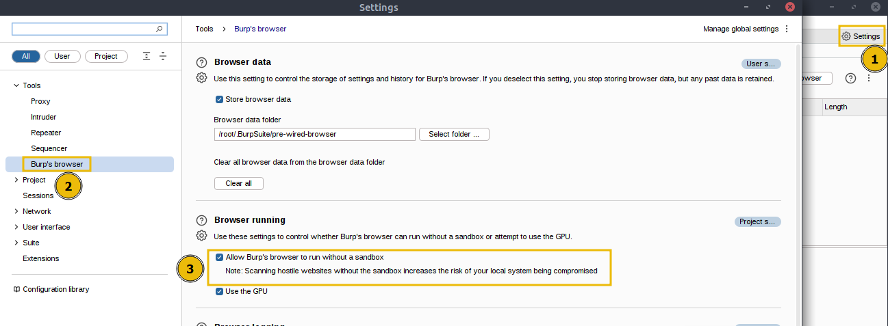
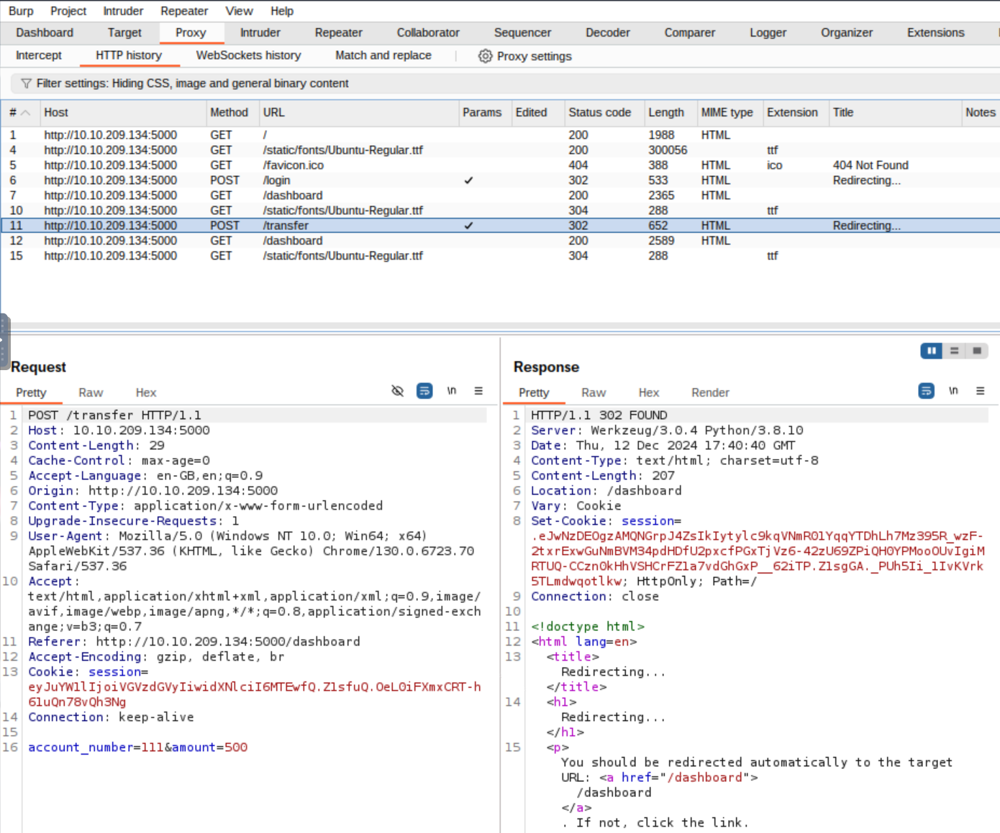
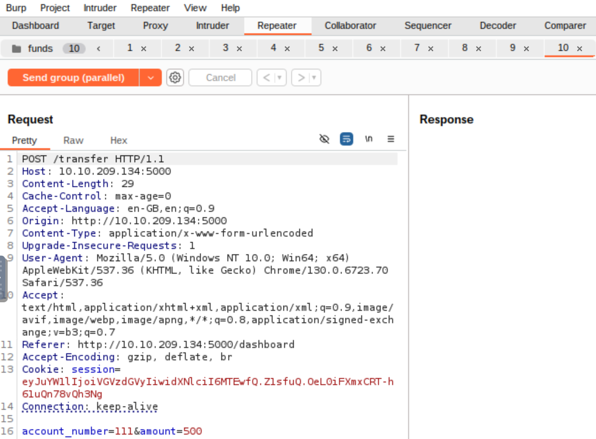
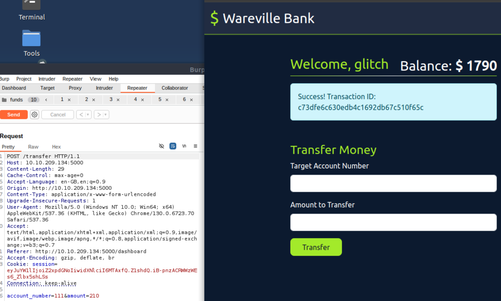

### Advent of Cyber 2024 - Day 12

## Challenge Overview
Understand and exploit a race condition vulnerability in a banking application, demonstrating how improper handling of concurrent requests can lead to unintended consequences.

---

## Steps

### Configuring Burp Suite
- Burp Suite was used to intercept and modify HTTP requests for the banking application.
- The browser was configured to route traffic through Burp Suite for analysis and manipulation.

---

### Analyzing Fund Transfer Functionality
- A single fund transfer request was intercepted and captured for analysis.
- The request contained parameters for account numbers and the transfer amount.

---

### Duplicating and Sending Parallel Requests
- The captured request was duplicated 10 times in Burp Suite's Repeater tab.
- All 10 requests were sent simultaneously to exploit the race condition.

---

### Exploiting the Race Condition
- By exploiting the race condition, multiple concurrent transfers were processed without updating the account balance in time.
- This resulted in a negative balance for the sender and an inflated balance for the recipient.

---

### Verifying the Exploit
- Successfully exploited the race condition and verified the vulnerability by transferring over $2000.
- Retrieved the flag from the dashboard after the exploit.

**Flag**: `THM{WON_THE_RACE_007}`

---

## Key Findings
1. **Vulnerability**:
   - Lack of atomic database transactions allows simultaneous requests to bypass balance checks.
2. **Impact**:
   - Exploiting race conditions can lead to financial inconsistencies, such as negative balances and unauthorized fund transfers.

---

## Recommendations
1. **Implement Atomic Transactions**: Ensure all database operations are atomic to prevent race conditions.
2. **Apply Mutex Locks**: Use locks to handle concurrent access to shared resources, like account balances.
3. **Rate Limiting**: Limit the number of requests processed per user within a specific time frame.

---

## Conclusion
This exercise emphasizes the importance of secure coding practices to prevent race conditions. By understanding and exploiting these vulnerabilities, developers can adopt best practices to safeguard critical systems.