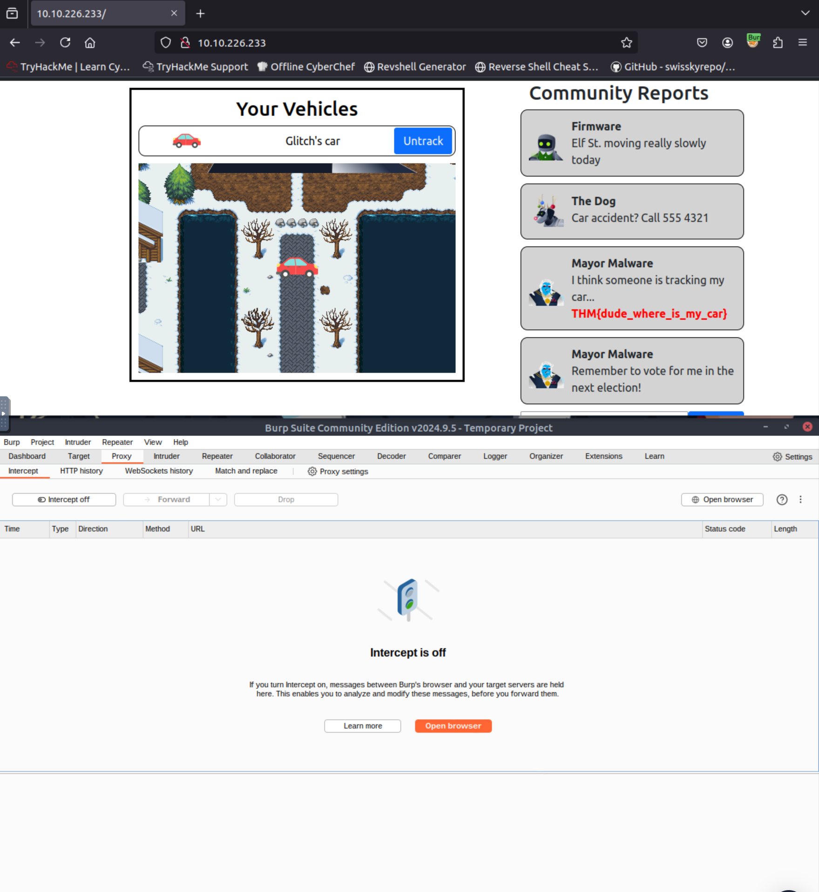
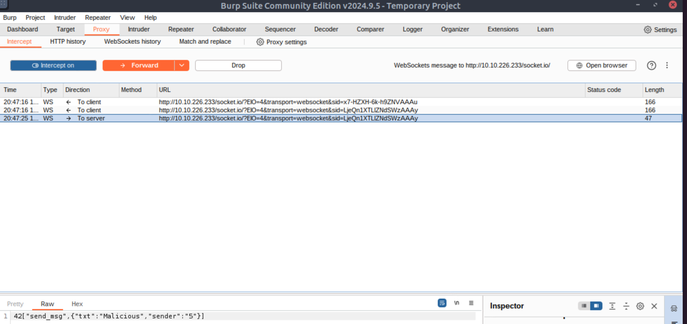
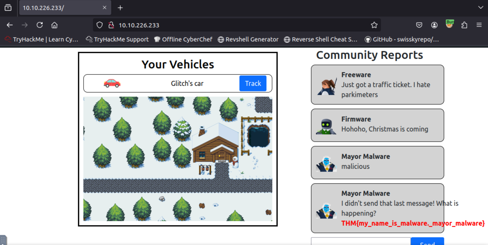

# Advent of Cyber 2024 - Day 13

## Challenge Overview
Explore WebSocket vulnerabilities by intercepting and manipulating WebSocket messages. This challenge focuses on exploiting a lack of validation in WebSocket communication to gain unauthorized access and impersonate other users.

---

## Steps

### Intercepting WebSocket Traffic
- Used Burp Suite to intercept WebSocket traffic for the Reindeer Tracker web application.
- Identified WebSocket messages containing the `userId` parameter, which controls the user being tracked.

### Exploiting the Track Functionality
- Modified the `userId` parameter in the intercepted WebSocket message from `5` to `8`.
- Successfully tracked user `8`, retrieving the first flag from the community reports.

---

### Exploiting the Community Message Feature
- Intercepted a message submission in the community reports feature.
- Altered the sender ID in the WebSocket message to impersonate `Mayor Malware` by changing the sender to `8`.
- Successfully posted a message under Mayor Malware's sender ID, retrieving the second flag.

---

## Key Findings
1. **Vulnerability**:
   - The application fails to validate WebSocket message parameters, allowing unauthorized changes to the `userId` and `senderId`.
2. **Impact**:
   - An attacker can impersonate other users, access their data, and perform actions on their behalf.

---

## Recommendations
1. **Parameter Validation**:
   - Validate WebSocket message parameters on the server side to prevent unauthorized modifications.
2. **Authentication and Authorization**:
   - Enforce proper authentication and session validation for WebSocket connections.
3. **End-to-End Encryption**:
   - Implement encryption for WebSocket communications to prevent tampering.

---

## Conclusion
This exercise demonstrates the risks of insufficient validation in WebSocket implementations. By exploiting these vulnerabilities, attackers can compromise user data and application functionality. Strengthening WebSocket security is crucial to prevent such exploits.
