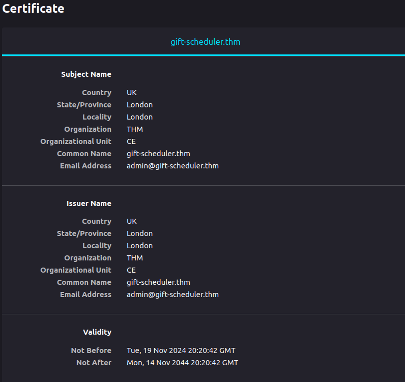
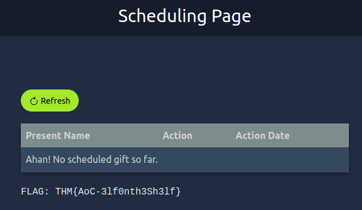

# Advent of Cyber 2024 - Day 14

## Challenge Overview
Explore the risks of self-signed certificates, intercept credentials using a Man-in-the-Middle attack, and exploit the Gift Scheduler platform to disrupt G-Day.

---

## Steps

### Setting Up the Attack Environment
- Added the Gift Scheduler’s IP to `/etc/hosts` to bypass DNS logging.
- Verified the entry using the `cat /etc/hosts` command.

---

### Intercepting Traffic with Burp Suite
- Configured Burp Suite proxy to capture traffic between users and the Gift Scheduler platform.
- Navigated to the Gift Scheduler website and bypassed the browser warning about the self-signed certificate.
- Verified the certificate details, confirming it was self-signed by "THM".

---

### Capturing Elf Credentials
- Captured the `snowballelf` account credentials from a POST request intercepted in Burp Suite.

- Logged in with the credentials `snowballelf:c4rrotn0s3` and retrieved the first flag from the scheduling page.

---

### Capturing Admin Credentials
- Intercepted additional POST requests and captured `Marta May Ware's` credentials.

- Logged in with the credentials `martamayware:H0llyJ0llySOCMAS!` and accessed the admin panel.
- Retrieved the second flag from the admin page.

---

## Key Findings
1. **Vulnerability**:
   - The platform uses a self-signed certificate, enabling MITM attacks.
   - Lack of encryption and parameter validation exposes user credentials in cleartext.
2. **Impact**:
   - An attacker can intercept and misuse credentials to access sensitive areas of the platform.

---

## Recommendations
1. **Use CA-Signed Certificates**:
   - Replace the self-signed certificate with a certificate signed by a trusted Certificate Authority (CA).
2. **Encrypt Communication**:
   - Implement end-to-end encryption for all sensitive data transmitted between the server and clients.
3. **Secure Credentials**:
   - Store and transmit credentials securely, ensuring they are never exposed in cleartext.

---

## Conclusion
This exercise highlights the risks posed by self-signed certificates and the lack of secure communication protocols. Ensuring the implementation of proper encryption and trusted certificates is vital to prevent such attacks.