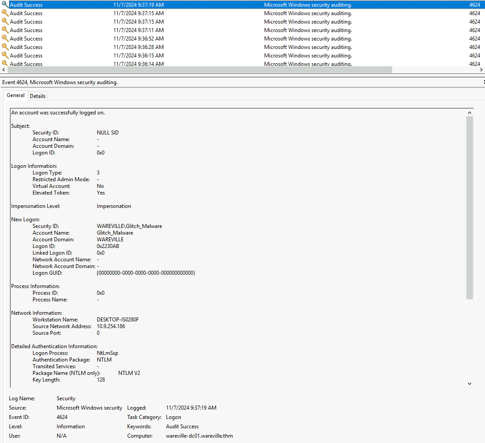
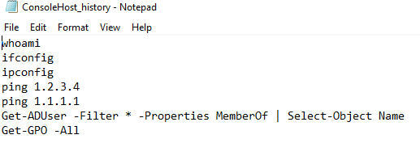
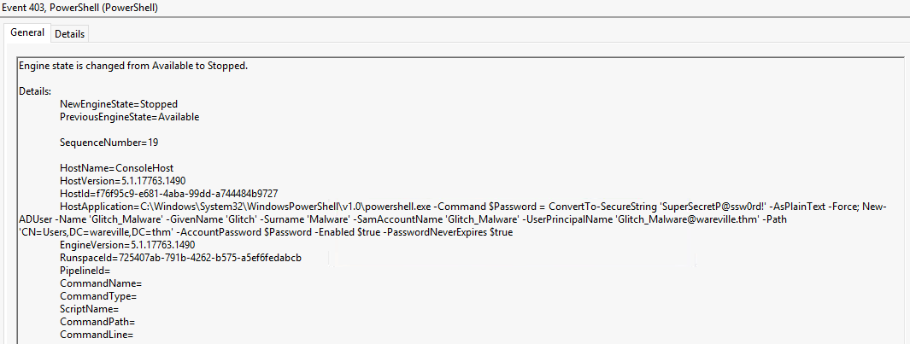
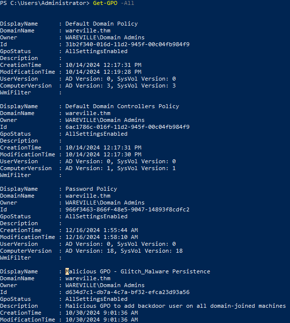

# **Advent of Cyber 2024 - Day 15**

## **Challenge Overview**
Investigate a suspected breach on the WareVille Active Directory environment. Analyze logs, review PowerShell command history, and identify malicious Group Policy Objects (GPOs) used for persistence.

---

## **Steps**

### **Investigating Successful Login Events**
1. Open **Event Viewer** and navigate to the `Security` logs.
2. Filter by **Event ID 4624** to identify successful login events.

- Observed that the `Glitch_Malware` user successfully logged in on **07/11/2024**.



---

### **Reviewing PowerShell Command History**
1. Accessed the **PowerShell history file** at:
   ```
   %APPDATA%\Microsoft\Windows\PowerShell\PSReadLine\ConsoleHost_history.txt
   ```
2. Found a command used to enumerate Active Directory users:
   ```powershell
   Get-ADUser -Filter * -Properties MemberOf | Select-Object Name
   ```



---

### **Analyzing PowerShell Logs**
1. Navigated to **Event Viewer > Applications and Services Logs > Windows PowerShell**.
2. Identified the creation of a new backdoor user `Glitch_Malware` with the password:
   ```
   SuperSecretP@ssw0rd!
   ```



---

### **Reviewing Group Policy Objects**
1. Ran the following PowerShell command to list all GPOs:
   ```powershell
   Get-GPO -All
   ```
2. Found a malicious GPO titled:
   ```
   Malicious GPO - Glitch_Malware Persistence
   ```
   - Description: Used to add a backdoor user on all domain-joined machines.



---

## **Key Findings**
1. **Malicious User Account**:  
   - A new user `Glitch_Malware` was created with the password `SuperSecretP@ssw0rd!`.

2. **Persistence Mechanism**:  
   - A malicious GPO (`Malicious GPO - Glitch_Malware Persistence`) was installed to maintain unauthorized access across domain-joined machines.

3. **Unauthorized Enumeration**:  
   - AD users were enumerated using PowerShell commands.

---

## **Recommendations**
1. **Audit Group Policies**:  
   - Regularly review GPOs for unauthorized changes.

2. **Monitor Logins**:  
   - Monitor for unusual logins, especially with Event ID **4624**.

3. **Secure PowerShell Usage**:  
   - Enable PowerShell logging and restrict its usage to authorized users.

4. **Review User Accounts**:  
   - Immediately disable and remove unauthorized accounts like `Glitch_Malware`.

---

## **Conclusion**
The breach was caused by unauthorized GPO modifications and the creation of a persistent user account. Proper auditing and monitoring of GPOs, logs, and PowerShell activities are critical for detecting and mitigating similar threats.
