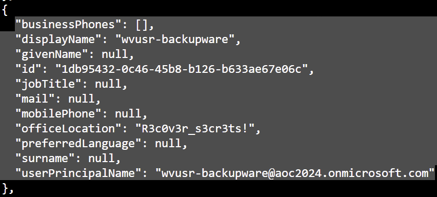
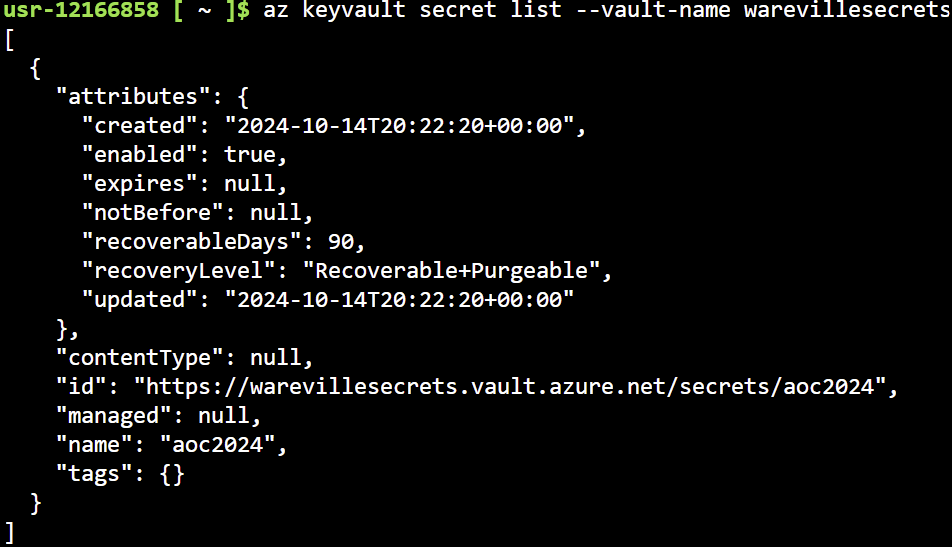
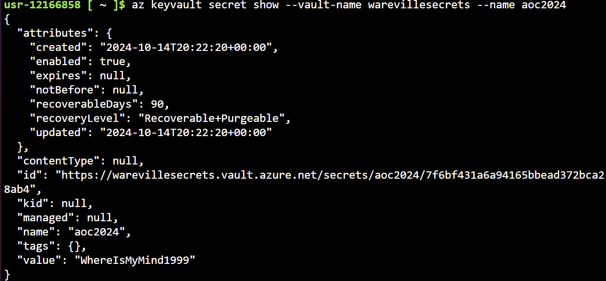

# Advent of Cyber 2024 - Day 16

## Challenge Overview
Explore Azure services like Azure Key Vault and Microsoft Entra ID, perform reconnaissance, and escalate privileges to access secrets stored in the tenant.

---

## Steps

### Enumerating Users in Azure Entra ID
- Used the Azure CLI to enumerate Entra ID users.
- Discovered an interesting user `wvusr-backupware` with a leaked parameter in the `officeLocation` field.

```bash
az ad user list --filter "startsWith('wvusr-', displayName)"
```



---

### Identifying Groups and Role Assignments
- Enumerated Azure groups and identified the **Secret Recovery Group**, which had roles granting access to Key Vault secrets.

```bash
az ad group list
az ad group member list --group "Secret Recovery Group"
```

- Checked the group’s role assignments and confirmed access to the **warevillesecrets** vault.

```bash
az role assignment list --assignee SECRET_RECOVERY_GROUP_ID --all
```

---

### Exploiting Key Vault Access
- Listed available Key Vaults and retrieved secrets using the Azure CLI.

```bash
az keyvault list
az keyvault secret list --vault-name warevillesecrets
az keyvault secret show --vault-name warevillesecrets --name aoc2024
```




- Successfully accessed the secret `aoc2024`, which contained sensitive data: **WhereIsMyMind1999**.

---

## Key Findings
1. **Vulnerability**:
   - Misconfigured role assignments allowed unauthorized access to Azure Key Vault secrets.
   - Sensitive credentials were leaked via user attributes (`officeLocation` field).

2. **Impact**:
   - Unauthorized access to secrets stored in the Key Vault compromises data integrity and confidentiality.
   - Attackers could escalate privileges using leaked credentials and group roles.

---

## Recommendations
1. **Review Role Assignments**:
   - Regularly audit role-based access control (RBAC) configurations to ensure the principle of least privilege.

2. **Secure User Attributes**:
   - Validate and sanitize user attributes to prevent accidental exposure of sensitive information.

3. **Monitor Key Vault Access**:
   - Enable logging and auditing for Key Vault access to detect unauthorized access attempts.

4. **Implement Conditional Access Policies**:
   - Restrict access to sensitive Azure resources using conditional access policies, such as IP whitelisting or MFA.

---

## Conclusion
This challenge highlights the importance of securing Azure environments through proper access control, monitoring, and auditing. Misconfigurations and credential leaks can lead to privilege escalation and unauthorized access, compromising sensitive data.
