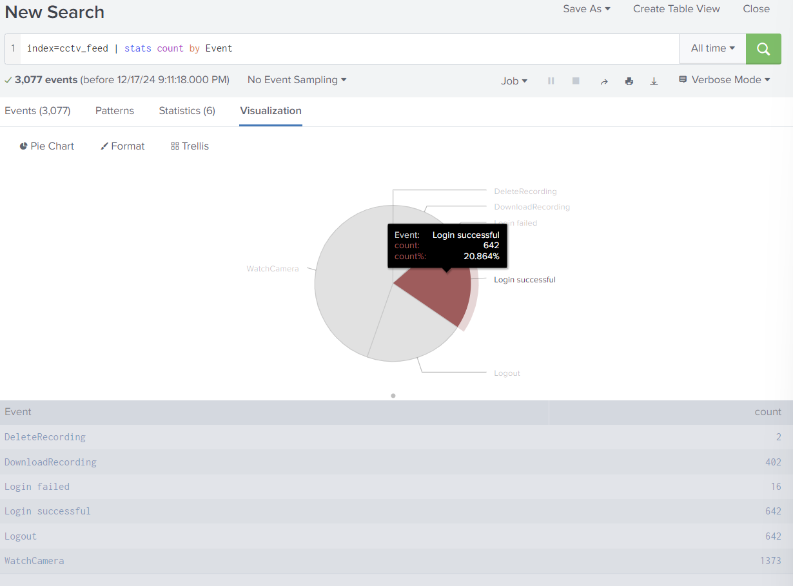
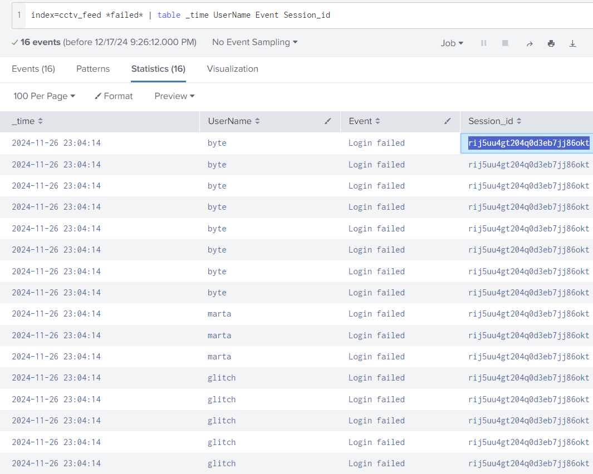
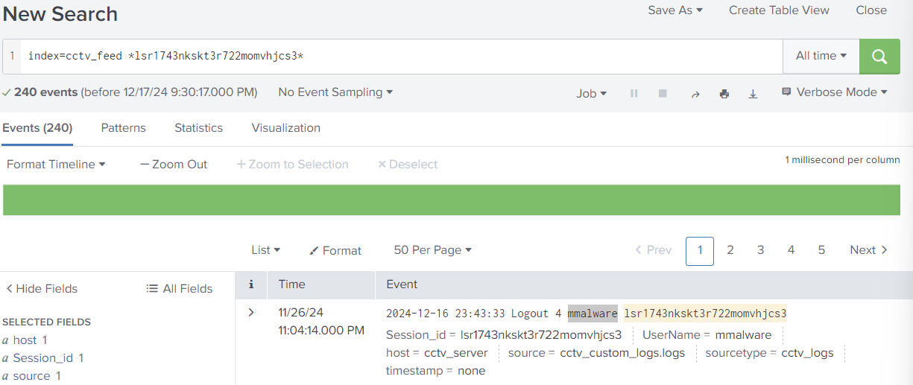

# Advent of Cyber 2024 - Day 17

## Challenge Overview
Investigate suspicious activities using Splunk SIEM by analyzing logs, extracting fields, and identifying unauthorized access and CCTV footage deletion.

---

## Steps

### Analyzing the Logs
- Accessed Splunk and queried the `cctv_feed` logs to get an overview of the events.

```spl
index=cctv_feed | stats count by Event
```

- Found **642 successful logins** and observed other suspicious activities, including failed logins and footage deletions.



---

### Investigating Failed Login Attempts
- Filtered logs to identify failed login attempts and their associated **Session_id**.

```spl
index=cctv_feed *failed* | table _time UserName Event Session_id
```

- Discovered the session ID `rij5uu4gt204q0d3eb7jj86okt` linked to multiple failed attempts.



---

### Correlating the Session ID with Other Events
- Narrowed the search to investigate the activities associated with the suspicious session ID.

```spl
index=cctv_feed *rij5uu4gt204q0d3eb7jj86okt*
```

- Observed a **delete recording** event tied to the same session ID, indicating malicious activity.

---

### Identifying the Attacker
- Correlated logs and identified the **username** linked to the session ID responsible for the deletion.

```spl
index=cctv_feed *lsr1743nkskt3r722momvhjcs3* | table _time UserName Event Session_id
```

- Confirmed the attacker’s username: `mmalware`.



---

## Key Findings
1. **Unauthorized Access**:
   - The attacker brute-forced accounts, resulting in multiple failed logins.
   - Successfully logged in and performed malicious activities, such as watching, downloading, and deleting CCTV footage.

2. **Session Hijacking**:
   - The session ID `rij5uu4gt204q0d3eb7jj86okt` was used to delete CCTV recordings.

3. **Identified Attacker**:
   - Username responsible for the malicious activity: `mmalware`.

---

## Recommendations
1. **Implement Account Lockouts**:
   - Lock user accounts after a set number of failed login attempts to prevent brute-force attacks.

2. **Enable Session Monitoring**:
   - Monitor session activity to detect and terminate suspicious sessions.

3. **Strengthen Authentication**:
   - Enforce multi-factor authentication (MFA) to prevent unauthorized access.

4. **Audit Logs Regularly**:
   - Continuously review logs for unusual activities and correlate events to identify anomalies.

5. **Restrict User Permissions**:
   - Apply the principle of least privilege to prevent unauthorized actions, such as deletions.

---

## Conclusion
This investigation highlighted the importance of robust monitoring, authentication, and account protection mechanisms. Timely log analysis and field extractions using Splunk enabled the detection of unauthorized access and malicious activities.
