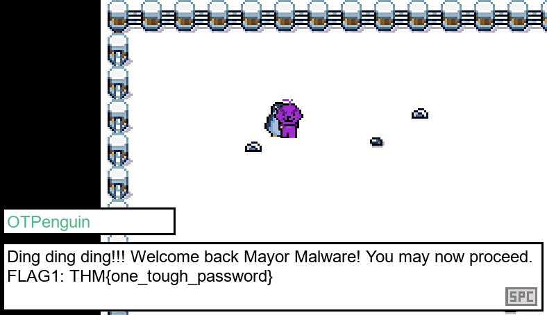

# Advent of Cyber 2024 - Day 19

## Challenge Overview
Learn how to manipulate a game's internal logic using Frida by intercepting and modifying function calls. Understand how to identify and change key parameters, bypass restrictions, and uncover hidden functionalities in a multi-level game.

---

## Steps

### Exploring the Game

The game starts with a penguin asking for a One-Time Password (OTP). This stage can be bypassed using Frida to intercept the function calls:


1. **Using Frida for the OTP Stage**:
   - Intercept the `_Z7set_otpi` function with Frida.
   - Log the parameter value for OTP:
     ```javascript
     defineHandler({
       onEnter(log, args, state) {
         log('_Z7set_otpi()');
         log("Parameter:" + args[0].toInt32());
       },
       onLeave(log, retval, state) {}
     });
     ```
     
   - Use the extracted OTP in the game:
   
     

---

### Hacking Purchases

In the second stage, purchasing a costly item becomes a challenge. Frida allows you to bypass the cost check by intercepting the `_Z17validate_purchaseiii` function.

1. **Intercept Purchase Function**:
   - Modify the price parameter to `0`:
     ```javascript
     args[1] = ptr(0);
     ```

   - Buy the item for free:

     

---

### Biometrics Bypass

The final stage involves a biometric check. The function `_Z16check_biometricsPKc` verifies input strings, and Frida can intercept and modify its return value to bypass the check.

1. **Intercept Biometric Check**:
   - Log the return value of the function:
     ```javascript
     onLeave(log, retval, state) {
       log("The return value is: " + retval);
     }
     ```

   - Replace the return value to simulate a successful check:
     ```javascript
     retval.replace(ptr(1));
     ```

   - Successfully bypass the biometrics:
   
     

---

## Key Findings
- The game was vulnerable to **API interception** and **parameter manipulation**.
- Exploiting the library functions allowed the bypass of critical game mechanics.

---

## Recommendations
1. **Secure API Interactions**:
   - Obfuscate function names and ensure they are non-trivial to trace.

2. **Implement Validation**:
   - Perform server-side validation for sensitive actions like purchases.

3. **Conduct Penetration Testing**:
   - Regularly test applications for vulnerabilities using tools like Frida.

4. **Employ Anti-Cheat Mechanisms**:
   - Integrate protections to detect and prevent memory and API tampering.

---

## Conclusion
This task highlights the risks associated with insecure application APIs. Tools like Frida demonstrate how attackers can intercept and modify internal functions to gain an advantage. Securing applications through proper validation and security practices is essential to prevent exploitation.
