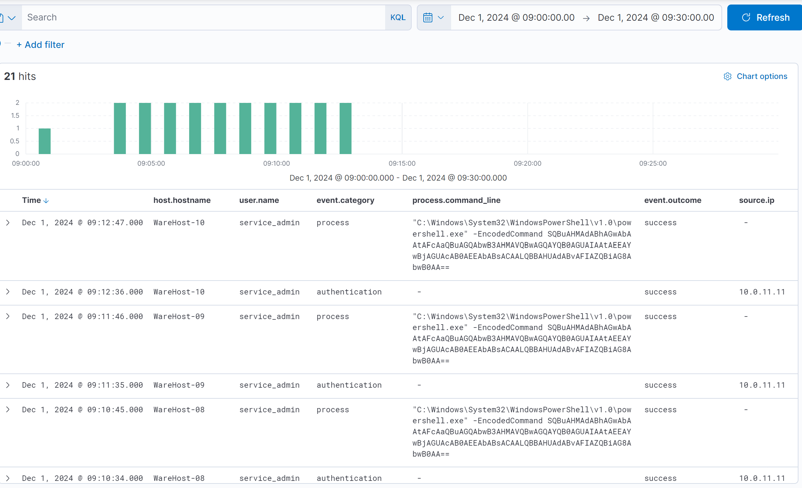
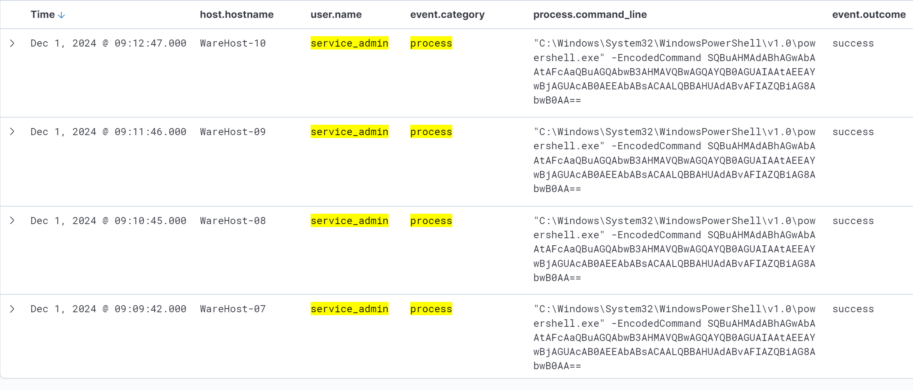
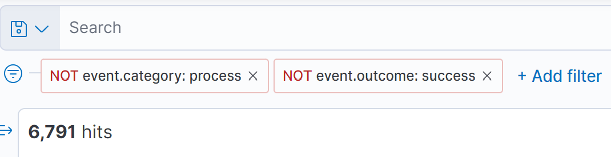
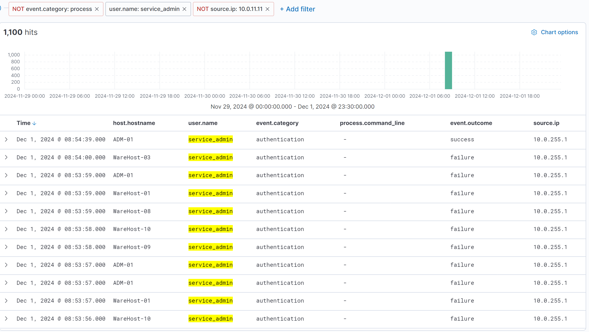

# Advent of Cyber 2024 - Day 2

## Challenge Overview
Day 2 of Advent of Cyber 2024 focuses on helping Wareville’s Security Operations Center (SOC) investigate suspicious activity involving encoded PowerShell commands executed on multiple machines. The SOC analysts suspect a brute-force attack, and our task is to analyze the alerts and decode the commands to determine whether the events are True Positives (TP) or False Positives (FP).

## Observations
Upon logging into the Elastic SIEM and setting the timeframe to December 1, 2024, between 09:00 and 09:30, we observed 21 events. By adding relevant fields (`host.hostname`, `user.name`, `event.category`, `process.command_line`, `event.outcome`, and `source.ip`), we noticed that the `service_admin` account executed multiple encoded PowerShell commands across several hosts (`WareHost-07`, `WareHost-08`, `WareHost-09`, `WareHost-10`).

### Logging into Elastic SIEM
Using the provided credentials, we logged into the Elastic SIEM.  

### Setting the Timeframe for Analysis
The alert specified that the suspicious activity occurred on **December 1, 2024**, between **09:00 and 09:30**. We updated the time filter to this range in Elastic SIEM.  

### Adding Relevant Fields for Investigation
To make the logs readable and extract key information, we added the following fields:
- `host.hostname`: Identifies the machine where the command was executed.
- `user.name`: The account used to execute the command.
- `event.category`: Classifies the event type (e.g., process, authentication).
- `process.command_line`: The command executed.
- `event.outcome`: The result (e.g., success, failure).
- `source.ip`: The originating IP address.

### Analyzing the Suspicious PowerShell Commands
We identified multiple encoded PowerShell commands executed by the `service_admin` account on various hosts (`WareHost-07`, `WareHost-08`, `WareHost-09`, `WareHost-10`).  

Each execution was successful, and the same encoded command was observed across all hosts. Before these commands were executed, successful login events were recorded for the `service_admin` account.

---

### Filtering for Failed Login Attempts
We expanded the timeframe to analyze previous activity from November 29, 2024, to December 1, 2024. Filtering for failed logins revealed a total of **6,791 failed logon attempts**, suggesting a potential brute-force attack targeting the `service_admin` account.  

---

### Identifying the Source of Logins
We noted that the successful login and subsequent PowerShell executions originated from the IP address **10.0.255.1**, which was not associated with legitimate users. The pattern of failed attempts followed by a successful login strongly indicated a brute-force attack.  

---

### Decoding the PowerShell Command
The encoded PowerShell command was Base64-encoded. Using CyberChef, we decoded it to reveal:

---

### Key Findings
There were several indicators of a Brute-Force Attack:
- Account Compromised: `service_admin`
- Number of Failed Logins: `6,791`
- Source IP Address: `10.0.255.1`
- Time of Successful Login: `Dec 1, 2024, 08:54:39.000`

The decoded PowerShell command revealed the intent to resolve the recurring failed login attempts caused by outdated credentials. The actor executed the command to install Windows updates and reboot the system, securing the machines.

### Key Takeaways
Through correlation and event analysis, we determined that the alerts were True Positives (TP). However, instead of being malicious, the activity was performed by Glitch, who brute-forced into the system to fix an issue. This highlights the importance of:
- Contextual analysis to differentiate between TPs and FPs.
- Decoding suspicious activity to uncover the true intent.
- Monitoring and enforcing strict access policies to prevent unauthorized access.