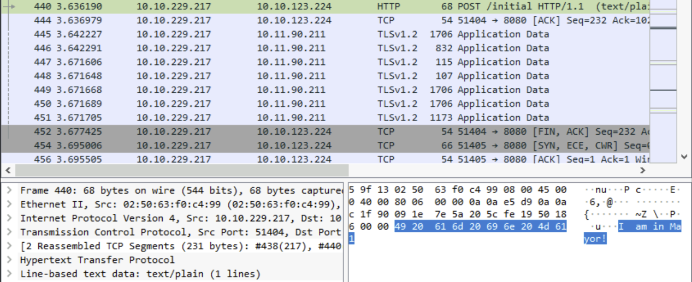
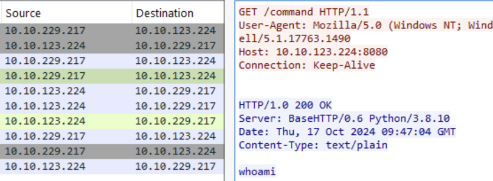
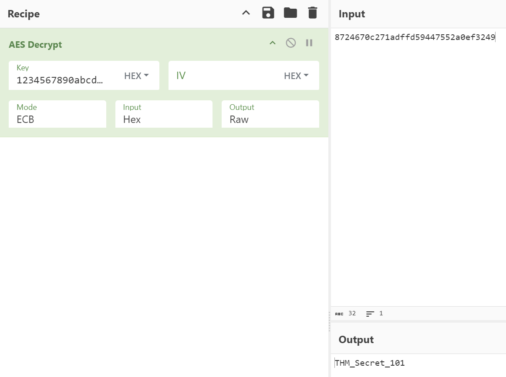

# Advent of Cyber 2024 - Day 20

## Learning Objectives
In this task, you will:
- Investigate network traffic using Wireshark.
- Identify indicators of compromise (IOCs) in captured network traffic.
- Understand how C2 servers operate and communicate with compromised systems.

---

## Investigating the Depths

Wireshark is a powerful tool for analyzing network traffic and understanding how Command and Control (C2) communications occur during an attack. In this challenge, we investigated a compromised machine to uncover Mayor Malware’s schemes.

1. **Filtering Outbound Traffic**:
   Using Wireshark, we filtered packets originating from the compromised machine with the filter:
   ```
   ip.src == 10.10.229.217
   ```

2. **Analyzing Key Packets**:
   - **Frame 440**: The payload sent a POST request to the C2 server containing the message:
     > "I am in Mayor!"
     
     
   - **Frame 457**: The C2 server responded with a GET request and sent the command:
     > "whoami"
     

3. **File Exfiltration**:
   The attacker exfiltrated a critical file via POST:
   > Filename: `credentials.txt`

---

## Decoding the Encrypted Beacon

Beacons are periodic updates sent from the compromised machine to the C2 server. Mayor Malware encrypted these beacons to obscure their content.

1. **Exfiltrated File Content**:
   Using the provided AES key, we decrypted the beacon with CyberChef:
   - **Key**: `1234567890abcdef1234567890abcdef`
   - **Mode**: ECB
   - **Decrypted Content**:  
     

---

## Key Findings
**Indicators of Compromise**:
   - Outbound traffic containing messages and commands between the compromised machine and the C2 server.
   - Exfiltration of sensitive files.

---

## Recommendations
1. **Monitor Network Traffic**:
   - Use tools like Wireshark to inspect unusual outbound traffic.

2. **Implement Firewalls**:
   - Restrict outbound communications to trusted IPs only.

3. **Encrypt Sensitive Data**:
   - Ensure proper encryption is applied to critical files.

4. **Conduct Incident Response Training**:
   - Train SOC analysts to detect and mitigate C2 activities.

---

## Conclusion

This exercise highlights the importance of monitoring and analyzing network traffic for signs of compromise. Tools like Wireshark and CyberChef are invaluable for SOC analysts in detecting malicious C2 activities and responding effectively.
