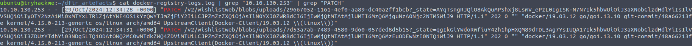
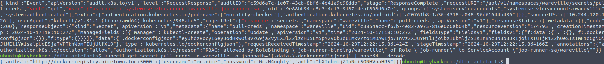

# Advent of Cyber 2024 - Day 22

## Challenge Overview
Investigate a Kubernetes environment compromised by Mayor Malware. Utilize audit logs, pod configurations, and registry logs to uncover the attacker's steps, including obtaining credentials and deploying a malicious webshell.

---

## Steps

### Key Findings in the Kubernetes Environment

#### 1. Shell Name Found
Mayor Malware used the webshell `shelly.php` to execute commands within the compromised Kubernetes pod.

#### 2. File Read and Commands Executed
The attacker accessed the `db.php` file and attempted to use `nc` (Netcat) to establish a remote connection.

#### 3. Unexpected IP Activity
Connections to the Docker registry were identified from the unexpected IP address `10.10.130.253`, indicating unauthorized access.

#### 4. First Connection Time
The initial connection from the unexpected IP occurred at `29/Oct/2024:10:06:33 +0000`.

#### 5. Time Malicious Image Pushed
The compromised image was pushed to the Docker registry at `29/Oct/2024:12:34:28 +0000`.

#### 6. Credentials Obtained
The `pull-creds` secret contained credentials that allowed the attacker to authenticate with the Docker registry.

---

## Recommendations

1. **Role-Based Access Control (RBAC)**:
   - Restrict `exec` permissions for non-admin users to prevent shell access within pods.

2. **Credential Segregation**:
   - Use separate credentials for pulling and pushing images to the Docker registry.

3. **Audit Log Monitoring**:
   - Continuously monitor audit logs to detect unauthorized actions.

4. **Network Access Control**:
   - Limit access to the Docker registry to trusted IPs only.

---

## Conclusion

This investigation uncovered a series of misconfigurations and overly permissive RBAC policies that allowed Mayor Malware to escalate privileges and deploy a malicious webshell. Implementing stricter controls and monitoring mechanisms will help prevent similar incidents in the future.
