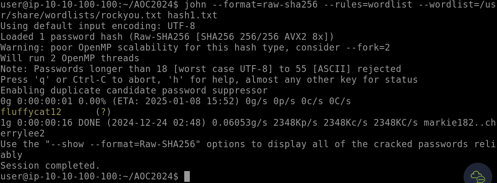
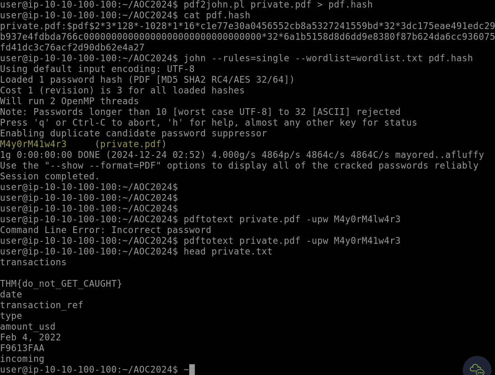

# Day 23 - Password Cracking

## Challenge Overview
Explore password security vulnerabilities by cracking hashes and accessing password-protected files to demonstrate weaknesses in password management and encryption practices.

---

## Steps

### Cracking a SHA-256 Hash
- Identified a leaked SHA-256 password hash from a compromised forum.
- Used `hash-id` to identify the hash type.
- Employed **John the Ripper** with the RockYou wordlist and rules to crack the hash.

```bash
john --format=raw-sha256 --rules=wordlist --wordlist=/usr/share/wordlists/rockyou.txt hash1.txt
```



---

### Extracting the Password from a Protected PDF
- Converted the password-protected PDF file into a hash using `pdf2john.pl`.

```bash
pdf2john.pl private.pdf > pdf.hash
```

- Used **John the Ripper** with a custom wordlist to successfully crack the hash.

```bash
john --rules=single --wordlist=wordlist.txt pdf.hash
```

- Password retrieved: **M4y0rM4lw4r3**.

- Accessed the decrypted PDF and extracted the flag.



---

## Key Findings
1. **Vulnerabilities in Password Security**:
   - Weak password choices (`fluffycat12`) and reusing easily guessable patterns lead to security breaches.
   - Use of common password-protected mechanisms (e.g., PDF passwords) without robust practices makes them exploitable.

2. **Impact**:
   - Weak passwords jeopardize account integrity and data confidentiality.
   - Simple cracking techniques highlight the risks of improper encryption and password management practices.

---

## Recommendations
1. **Implement Stronger Password Policies**:
   - Enforce complex password requirements, such as longer lengths, varied characters, and non-dictionary terms.
   - Regularly educate users on creating strong, unique passwords.

2. **Leverage Multi-Factor Authentication (MFA)**:
   - Add an extra layer of security to reduce reliance on password strength alone.

3. **Encrypt Sensitive Documents Using Modern Standards**:
   - Employ robust encryption tools with key-based access rather than simple password protection.

4. **Monitor for Data Breaches**:
   - Continuously monitor public breach data to identify exposed credentials and take proactive actions.

---

## Conclusion
This exercise highlights the dangers of weak passwords and insufficient encryption practices, emphasizing the need for stronger password policies, robust encryption techniques, and proactive monitoring to protect sensitive data.
