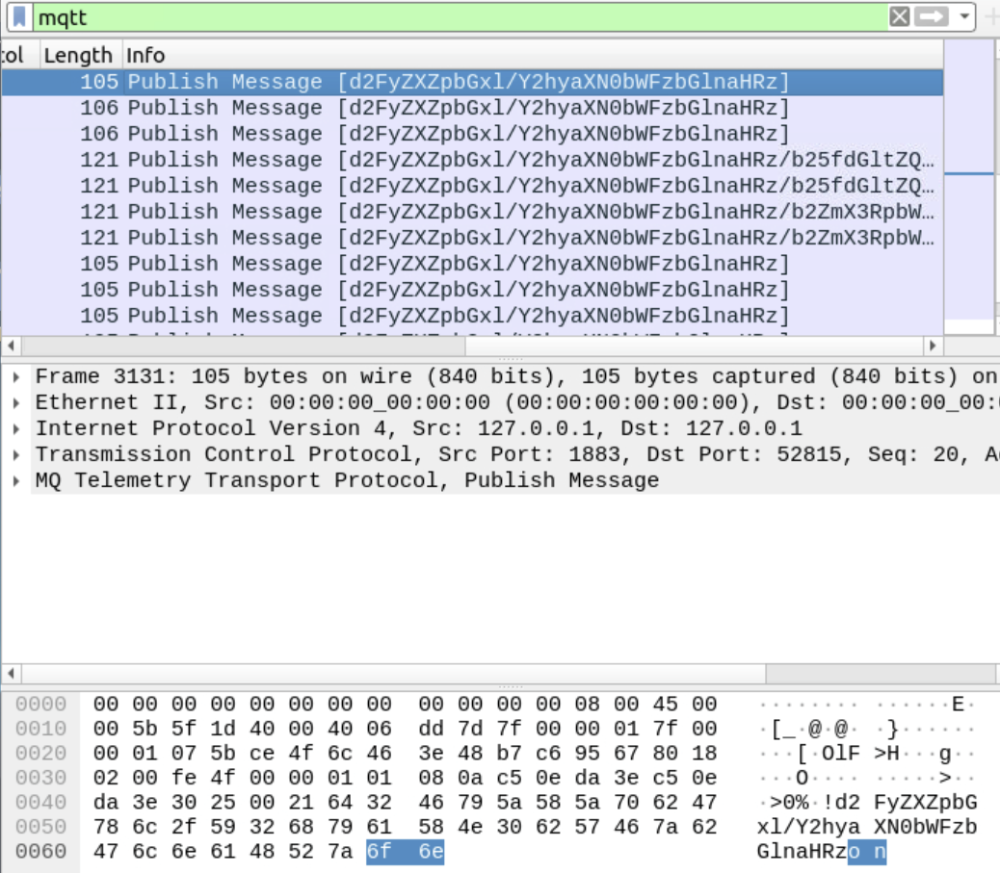
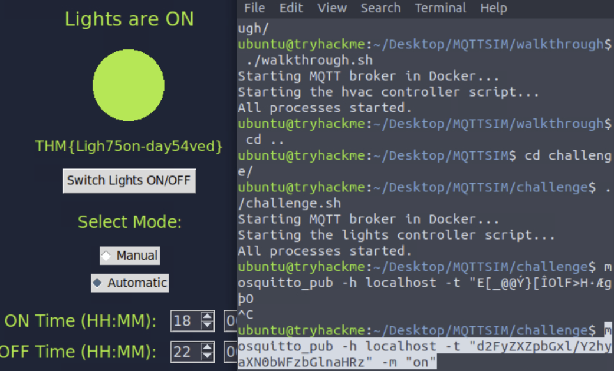

# Advent of Cyber 2024 - Day 24

## Challenge Overview
This challenge demonstrates how MQTT, a widely used protocol in IoT devices, can be exploited if proper security measures are not implemented. We investigate MQTT traffic to identify vulnerabilities and restore functionality to a compromised system.

---

## Steps

### Analyzing MQTT Traffic
- Used Wireshark to analyze MQTT packets captured in `challenge.pcapng`.
- Filtered the MQTT protocol to focus on relevant traffic.
- Identified the publish message and topic for controlling the lights.



---

### Restoring Lights Functionality
- Discovered the appropriate MQTT topic and message from packet analysis.
- Published a message using `mosquitto_pub` to restore lights functionality:

```bash
mosquitto_pub -h localhost -t "d2FyZXZpbGxl/Y2hyaXN0bWFzbGhnaHRz" -m "on"
```

- Successfully turned on the lights and obtained the flag.



---

## Key Findings
1. **Lack of Authentication in MQTT Protocol**:
   - MQTT messages were easily intercepted and manipulated due to the absence of authentication mechanisms.

2. **Weak Topic and Message Naming**:
   - The topic and message used for critical actions were predictable and not secured.

3. **Impact**:
   - Unauthorized access to MQTT messages can lead to significant disruptions, as seen with the lights being turned off.

---

## Recommendations
1. **Implement Authentication for MQTT Communication**:
   - Use username/password authentication or client certificates to prevent unauthorized access.

2. **Encrypt MQTT Messages**:
   - Secure MQTT messages with TLS to protect data in transit.

3. **Use Secure Topics and Messages**:
   - Employ non-predictable and unique topic names for critical functions.
   - Implement a validation mechanism to ensure messages are coming from trusted sources.

4. **Monitor IoT Traffic**:
   - Continuously monitor IoT traffic for anomalies to detect unauthorized actions.

---

## Conclusion
The MQTT protocol, while efficient, requires robust security measures to prevent exploitation. Authentication, encryption, and monitoring are essential to safeguard IoT ecosystems against potential threats.
