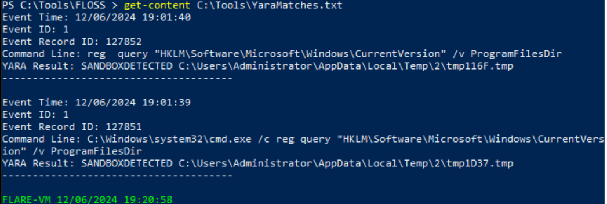
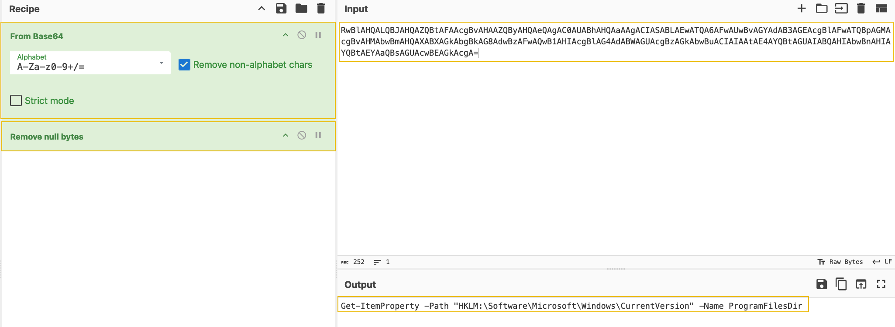

# Advent of Cyber 2024 - Day 6

## Challenge Overview
Analyze and detect evasive malware behavior using YARA rules, Sysmon, and Floss, while exploring evasion techniques and enhancing detection strategies.

---

## Learning Objectives
1. Analyze malware behavior using sandbox tools.
2. Explore how to use YARA rules to detect malicious patterns.
3. Learn about various malware evasion techniques.
4. Implement an evasion technique to bypass YARA rule detection.

---

## Steps

### Connecting to the Machine
- Start the machine using the connection card provided.
- If needed, use RDP with the provided credentials to access the virtual machine.
- **Credentials**:
  - Username: `administrator`
  - Password: `TryH@cKMe9#21`

### Detecting Sandboxes
- The malware uses the registry path `HKLM\Software\Microsoft\Windows\CurrentVersion` to determine if the environment is a sandbox.
- A query command (`reg query ... /v ProgramFilesDir`) is executed to check the presence of `C:\Program Files`, a directory typically absent in sandbox environments.

### YARA Rules
- A YARA rule was used to detect the specific registry query in the sandbox environment.
- **YARA Rule**:
  ```yara
  rule SANDBOXDETECTED
  {
      meta:
          description = "Detects sandbox by querying the registry key for Program Path"
          author = "TryHackMe"
          date = "2024-10-08"
          version = "1.1"

      strings:
          $cmd = "Software\\Microsoft\\Windows\\CurrentVersion\" /v ProgramFilesDir" nocase

      condition:
          $cmd
  }
```

- The custom script logged matching events in `C:\Tools\YaraMatches.txt`



### Running Malware and Observing Detection
- Run `MerryChristmas.exe` from `C:\Tools\Malware`
- The custom EDR flagged the malicious registry query and displayed a popup containing the flag.

![Flag Popup] (images/MalwareRanFlagFound.png)

### Adding More Evasion Techniques
- The registry query was encoded using Base64 and executed via PowerShell:
	- **Encoded Command:** `RwBlAHQALQBJAHQAZQBtAFAAcgBvAHAAZQByAHQAeQAgAC0AUABhAHQAaAAgACIASABLAEwATQA6AFwAUwBvAGYAdAB3AGEAcgBlAFwATQBpAGMAcgBvAHMAbwBmAHQAXABXAGkAbgBkAG8AdwBzAFwAQwB1AHIAcgBlAG4AdABWAGUAcgBzAGkAbwBuACIAIAAtAE4AYQBtAGUAIABQAHIAbwBnAHIAYQBtAEYAaQBsAGUAcwBEAGkAcgA=`
	- Use CyberChef to decode the Base64 String to reveal the PowerShell Command:
	


### Using Floss for Obfuscated String Detection

Run Floss on the Malware:
- `floss.exe C:\Tools\Malware\MerryChristmas.exe | Out-File C:\tools\malstrings.txt`
Review malstrings.txt for hidden strings.
Found the second flag: `THM{HiddenClue}`

![malstrings Text File] (images/2ndFlagFound.png)

### Analyzing Sysmon Logs with YARA Rules
- Extract relevant `EventRecordID` from `YaraMatches.txt`
- Apply a custom filter in Event Viewer:

```xml
<QueryList>
  <Query Id="0" Path="Microsoft-Windows-Sysmon/Operational">
    <Select Path="Microsoft-Windows-Sysmon/Operational">
      *[System[(EventRecordID="INSERT_EVENT_RECORD_ID_HERE")]]
    </Select>
  </Query>
</QueryList>
```


- Review Sysmon log details to identify the Parent Process, the Command Line Used, and User Privileges.

![Apply Custom Filter] (images/FilterCurrentLog.png)

![Event Details] (images/EventDetails.png)

---

## Key Findings:
1. The malware identified sandbox environments by querying specific registry keys.
2. Obfuscation techniques like Base64 encoding were used to evade detection.
3. Tools like YARA and Floss successfully detected and analyzed malicious patterns.
4. Sysmon logs provided critical insights into the malware's process execution and behavior.

---

## **Conclusions**
The analysis of Mayor Malware's sample highlights the critical importance of utilizing robust detection mechanisms such as YARA rules, Sysmon, and Floss for identifying and mitigating malicious activities. The following key points summarize the outcomes:

1. **Proactive Detection**: 
   - YARA rules demonstrated their effectiveness in detecting suspicious patterns such as registry queries, offering immediate insights into potential malicious actions.
   - Custom scripts enhanced detection capabilities, ensuring real-time alerts for flagged activities.

2. **Importance of Evasion Awareness**:
   - Malware authors continue to adapt and evolve by implementing techniques like obfuscation (e.g., Base64-encoded commands). 
   - Security professionals must stay vigilant and evolve their tools and detection strategies to counter these advanced techniques.

3. **Value of Comprehensive Monitoring**:
   - Sysmon logs provided invaluable forensic data, including the parent process, command-line execution, and user privileges, enabling a deep dive into the malware's behavior.
   - Such detailed logs assist in creating precise timelines and understanding the malware's impact on the system.

4. **Critical Role of String Analysis**:
   - Floss proved essential in uncovering hidden clues and strings embedded within the malware, emphasizing the importance of analyzing both static and dynamic aspects of the malware.

5. **Team Collaboration**:
   - The exercise reinforced the importance of collaboration between detection (blue team) and analysis (malware analysts) for a well-rounded defense strategy.

### **Final Takeaway**:
This challenge underscored the importance of leveraging multiple tools and techniques to stay ahead of attackers. The combination of proactive detection, thorough log analysis, and awareness of evasion strategies is essential for safeguarding systems against sophisticated threats. As malware evolves, so too must the tools and methodologies used to detect and neutralize it.

