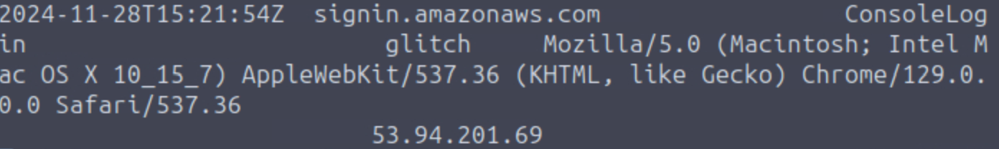
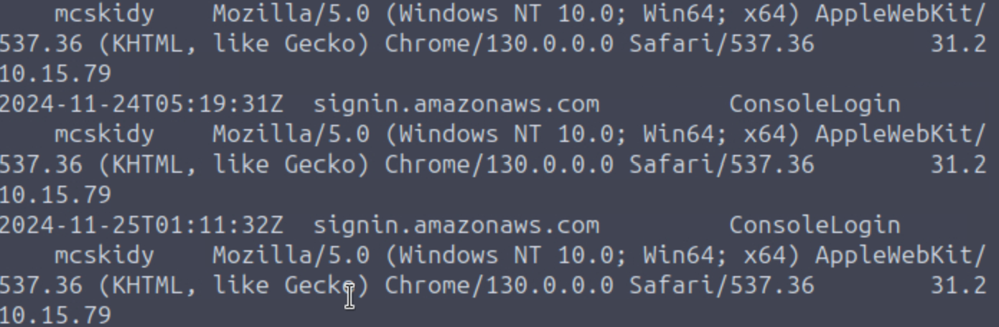
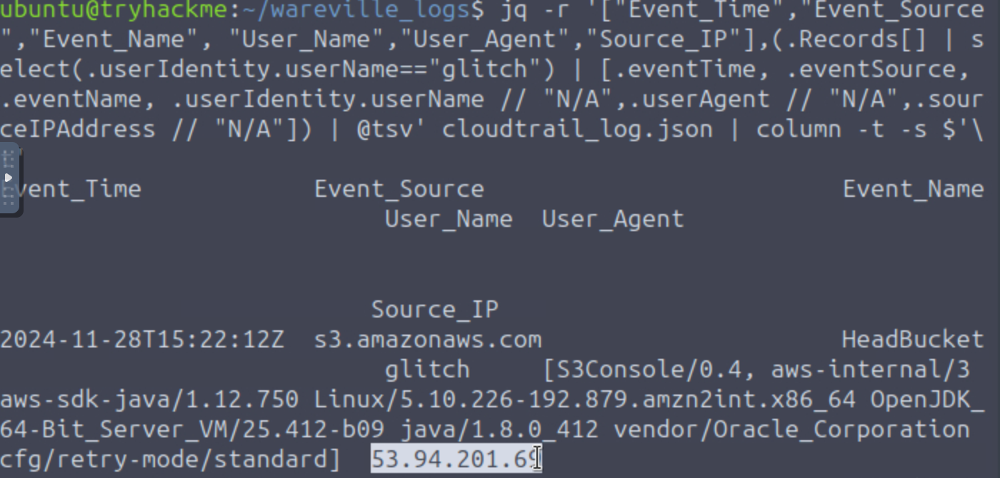
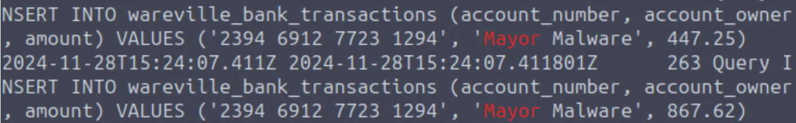

# Advent of Cyber 2024 - Day 7

## Challenge Overview
Investigate suspicious activities in an AWS environment involving S3 bucket misuse, anomalous user behavior, and a fraudulent bank account.

---

## Steps

### Analyze CloudTrail Logs for S3 Bucket Activity
Use JQ to filter for `wareville-care4wares` bucket activity:

```bash
jq -r '["Event_Time", "Event_Name", "User_Name", "Bucket_Name", "Key", "Source_IP"], (.Records[] | select(.eventSource == "s3.amazonaws.com" and .requestParameters.bucketName=="wareville-care4wares") | [.eventTime, .eventName, .userIdentity.userName // "N/A",.requestParameters.bucketName // "N/A", .requestParameters.key // "N/A", .sourceIPAddress // "N/A"]) | @tsv' cloudtrail_log.json | column -t
```

#### Output Highlights
The results show that the user `glitch` performed multiple actions on the S3 bucket:
- Uploaded a new file (`PutObject`) named `wareville-bank-account-qr.png`.
- The **Source IP** for these actions was `53.94.201.69`.


---

### Analyze Console Login Logs
Filter for `ConsoleLogin` events in CloudTrail:

```bash
jq -r '["Event_Time", "Event_Source", "Event_Name", "User_Name", "Source_IP"], (.Records[] | select(.userIdentity.userName == "glitch") | [.eventTime, .eventSource, .eventName, .userIdentity.userName // "N/A", .sourceIPAddress // "N/A"]) | @tsv' cloudtrail_log.json | column -t
```

#### Output Highlights
The `glitch` user triggered a `ConsoleLogin` event on `2024-11-28T15:21:54Z`, originating from the IP address `53.94.201.69`.



---

### Identify Who Created the User `glitch`
Filter CloudTrail logs for IAM-related events:

```bash
jq -r '["Event_Time", "Event_Source", "Event_Name", "User_Name", "Source_IP"], (.Records[] | select(.eventSource == "iam.amazonaws.com") | [.eventTime, .eventSource, .eventName, .userIdentity.userName // "N/A", .sourceIPAddress // "N/A"]) | @tsv' cloudtrail_log.json | column -t
```

#### Output Highlights
The user `mcskidy` created the anomalous account `glitch` and assigned administrative privileges from the same IP address as `glitch` (`53.94.201.69`).

  


---

### Examine Bank Transactions in RDS Logs
Check who received donations after the flyer update:

```bash
grep INSERT rds.log
```

#### Output Highlights
The RDS logs revealed that donations were redirected to an account owned by `Mayor Malware` with the bank account number `2394 6912 7723 1294`.



---

## Key Findings
- **Unauthorized Actions on S3 Bucket:** User `glitch` accessed the S3 bucket to upload a tampered flyer, redirecting donations.
- **Compromised Account:** Logs reveal that the `mcskidy` account created `glitch` and assigned administrative access from an IP inconsistent with `mcskidy`'s usual activity.
- **Suspicious IP Usage:** The IP `53.94.201.69` was consistently used for malicious activities by `mcskidy`, `glitch`, and `mayor_malware` accounts.
    - **McSkidy's Actual IP:** McSkidy's actual IP is 31.210.15.79 which differs from the IP performing malicious activities.
- **Redirected Donations:** RDS logs confirm donations were redirected to `Mayor Malware`'s fraudulent account.

---

## Conclusions
The investigation uncovered a compromised account (`mcskidy`) was used to create an anomalous user (`glitch`) with administrative privileges. This user was used to alter the donation flyer in an S3 bucket, redirecting funds to a fraudulent account owned by `Mayor Malware`.

### Recommendations
- **Strengthen Account Security:** Implement multi-factor authentication (MFA) and stricter IAM policies to prevent unauthorized access.
- **Continuous Monitoring:** Use AWS CloudTrail and CloudWatch for real-time monitoring of critical resources.
- **Audit IAM Events:** Regularly audit IAM logs for unusual activity, including user creation and privilege escalation.

---
